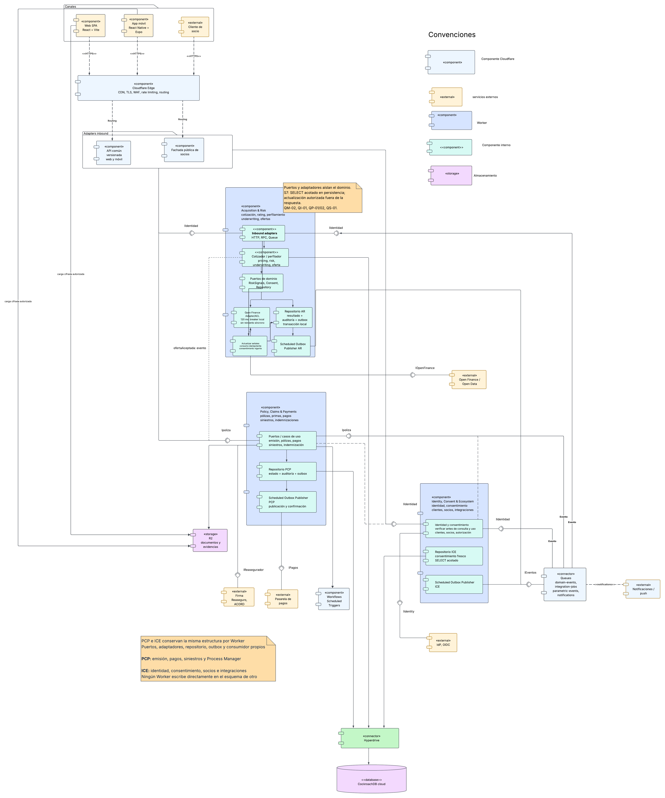
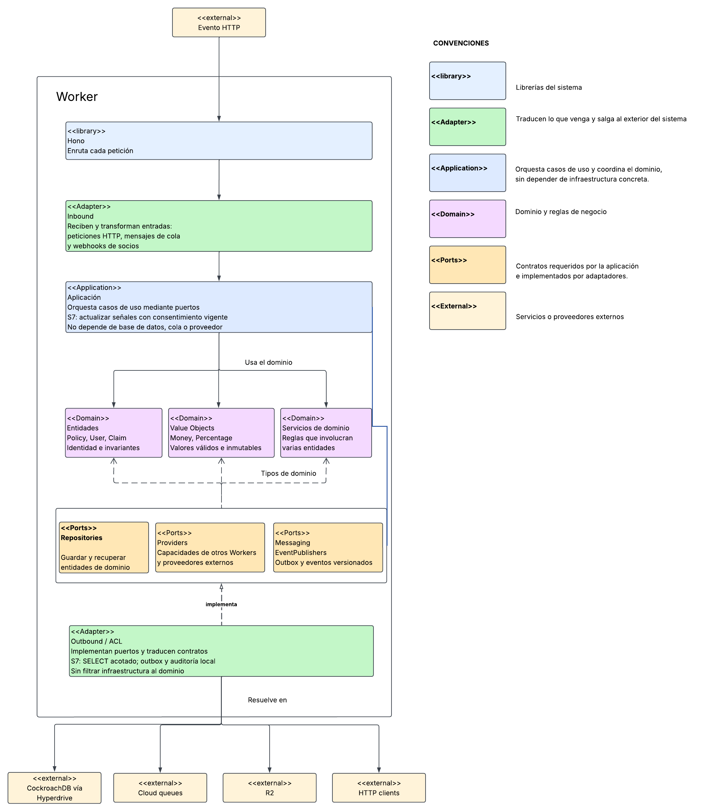
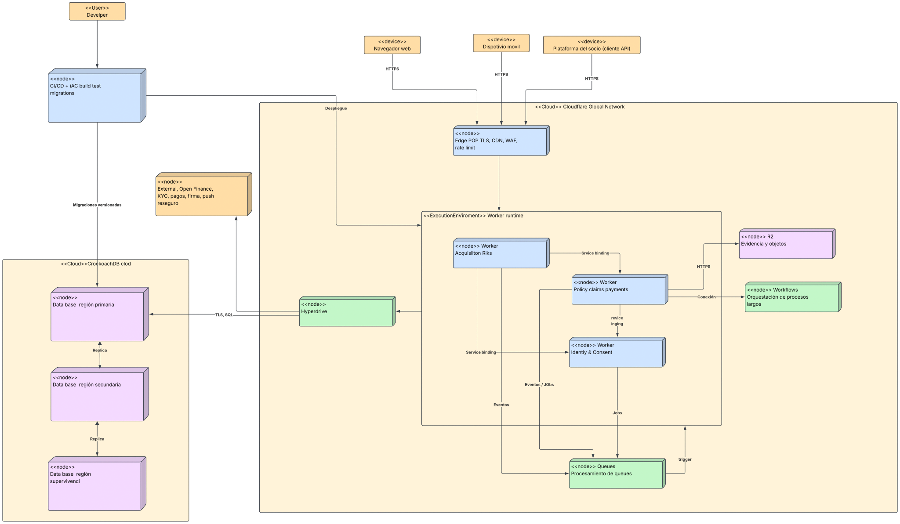
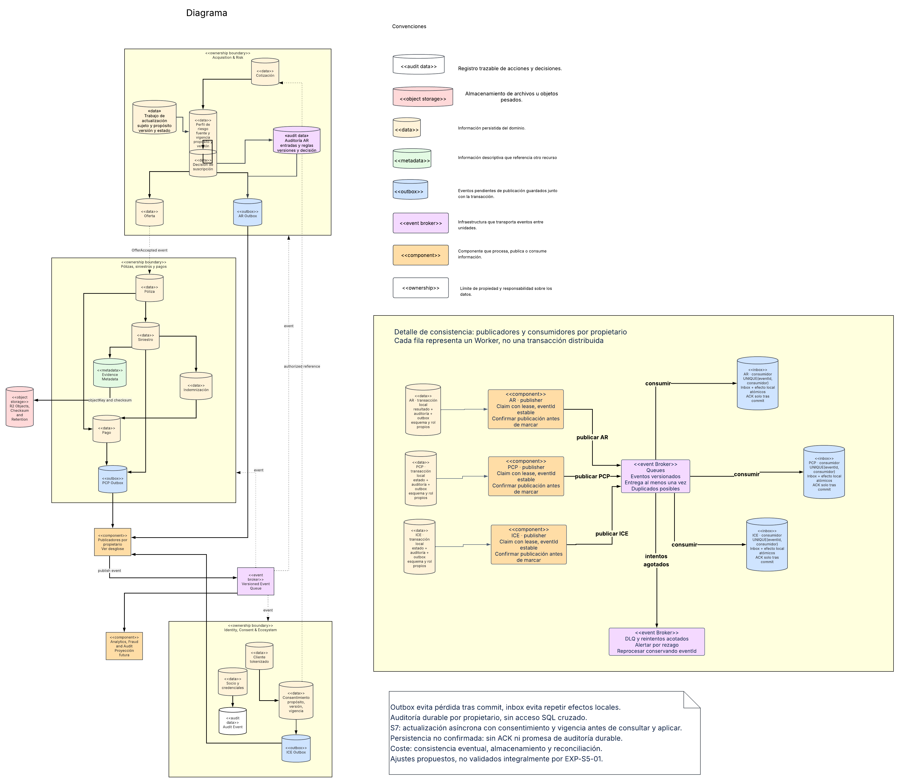
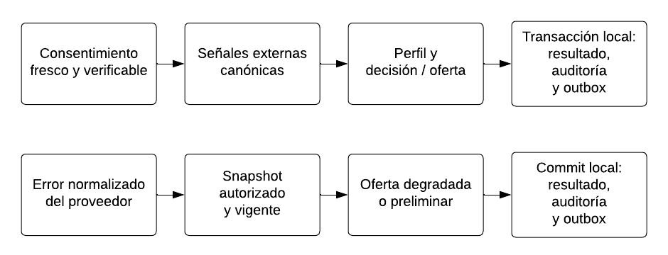
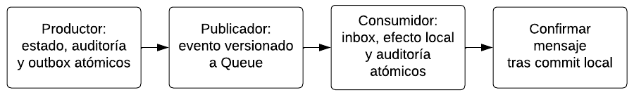
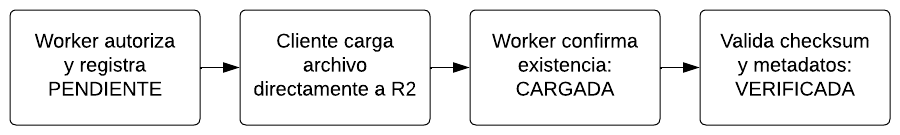
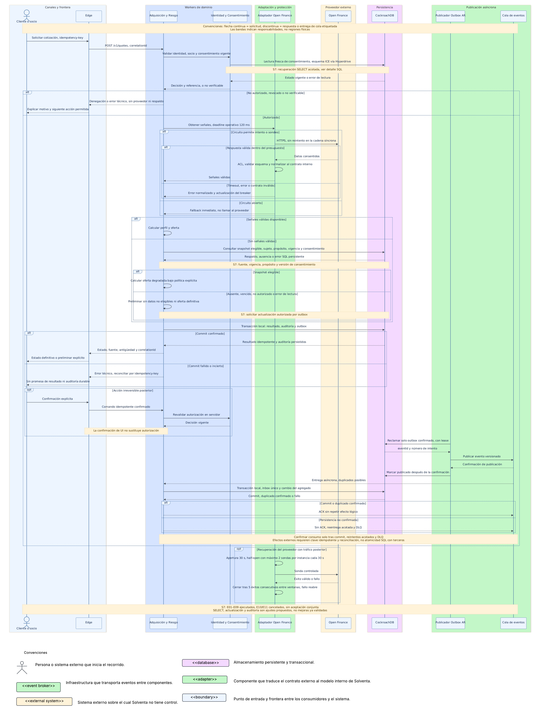
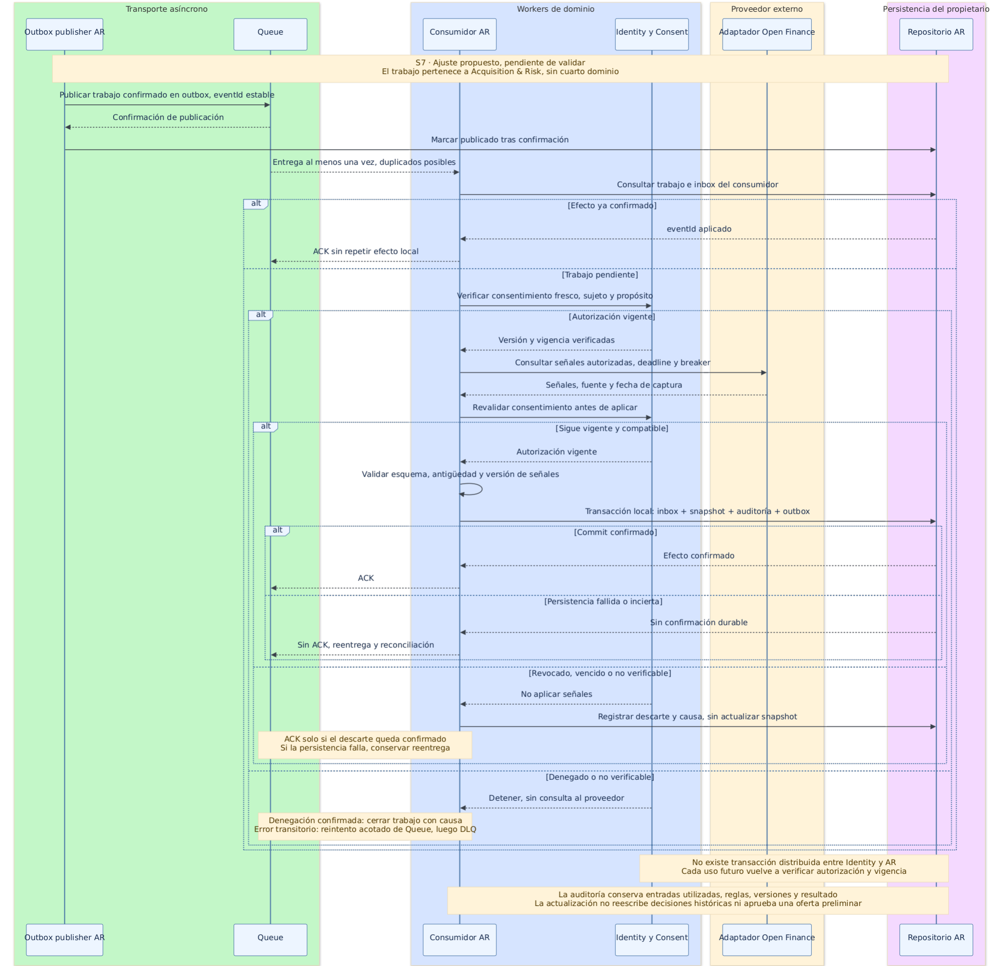
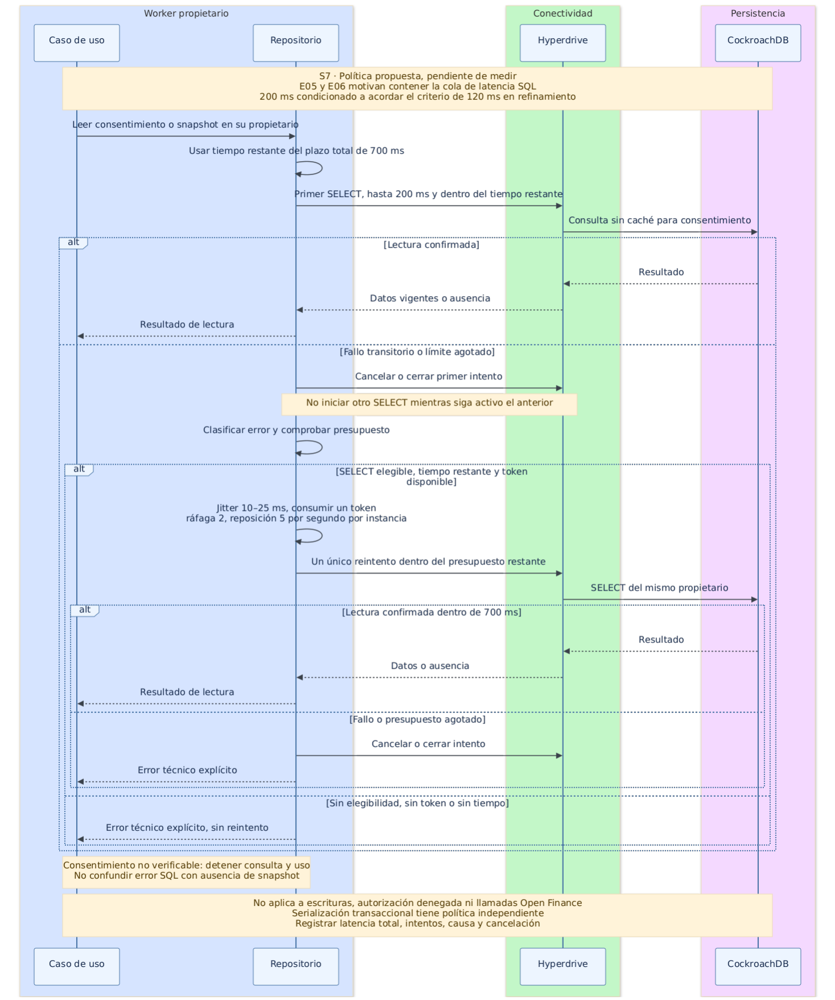

# Solventa - arquitectura refinada y detallada

Versión ajustada — Semana 7

Integrantes: Alejandro Forero, David Armando Rodríguez Varón, Juan Sebastián Sánchez Tabares y Yesid Arley Marín Rivera

## 1. Objetivo y alcance del documento

Este documento actualiza la arquitectura de Semana 6 con los resultados finales de 30 corridas de E01–E09. Conserva las vistas funcional, de despliegue, de información e interacción, las responsabilidades y los conectores. Incorpora recuperación acotada de lecturas SQL, actualización asíncrona autorizada y auditoría transaccional. Son ajustes de diseño propuestos para Proyecto Final 2: no se presentan como mejoras de rendimiento ya implementadas y validadas.

El experimento evalúa cotización y perfilamiento. Emisión, pólizas, pagos y siniestros mantienen sus historias y modelos, sin atribuirles validación por EXP-S5-01. La campaña se cerró con E01–E09: E10 y E11 no se ejecutaron. Como el protocolo S5 reservaba la aceptación formal a E11, el cierre constituye una desviación explícita, conserva los umbrales y deja la hipótesis conjunta no aceptada. Los 120 ms son un parámetro medido conservado, no un óptimo confirmado. Las 16 ejecuciones de S6 son antecedentes separados, no se suman a las 30 como una muestra homogénea.

## 2. Requisitos arquitectónicamente significativos

| ID | Atributo | Escenario resumido | Medida |
| :---- | :---- | :---- | :---- |
| QP-01 | Rendimiento | socio solicita cotización en pico normal | p95 ≤ 250 ms y p99 ≤ 500 ms E2E |
| QP-02 | Rendimiento | cliente autoriza perfilamiento con señales internas y externas | p95 ≤ 400 ms y p99 ≤ 800 ms E2E |
| QE-01 | Escalabilidad | campaña masiva de socio; el tráfico crece 100× | escalar de 500 a 50.000 cotizaciones/min conservando el p95; autoescalado ≤ 60 s; pendiente de validación |
| QE-02 | Escalabilidad | evento paramétrico masivo | absorber ≥ 1.000.000 de eventos en 10 min con contrapresión y sin pérdida; pendiente de validación |
| QE-03 | Escalabilidad | reprocesamiento batch de perfiles | reprocesar ≥ 10 millones de perfiles en < 2 h sin afectar la latencia del tráfico en línea; pendiente de validación |
| QA-01 | Disponibilidad | falla zonal | RTO ≤ 10 min y RPO ≤ 30 s; pendiente de ejercicio |
| QA-02 | Disponibilidad | falla regional | RTO ≤ 5 min y sin pérdida de transacciones confirmadas (RPO ≈ 0 para datos confirmados); pendiente de ejercicio |
| QA-03 | Disponibilidad | operación normal de journeys críticos de venta y siniestros | disponibilidad ≥ 99,97 % mensual; pendiente de medición mensual |
| QA-04 | Disponibilidad | recaudo y pago de indemnizaciones | disponibilidad ≥ 99,99 %, con idempotencia y cero pérdida de transacciones confirmadas; pendiente de medición mensual |
| QS-01/02 | Seguridad e integridad | acceso no autorizado, alteración o duplicado | denegación total, cero PII expuesta y cero efecto financiero indebido |
| QM-01/02 | Modificabilidad | nuevo producto o sustitución de proveedor | cambios confinados y núcleo sin dependencia de infraestructura |
| QI-01/02 | Integrabilidad | ACORD y evolución de API | contratos verdes y convivencia de versiones |

Los ASR de rendimiento, privacidad y modificabilidad gobiernan el recorrido evaluado. E01–E09 permiten dictámenes por objetivo; no acreditan aceptación integral. QE-01–QE-03 y QA-01–QA-04 conservan sus metas y requieren capacidad, medición mensual y ejercicios de falla propios en Proyecto Final 2. El rezago y la tasa de errores son diagnósticos, no sustitutos de umbrales. No se ejecutarán nuevas cargas para cerrar Semana 7.

### 2.1 Invariantes heredados y conservados

- Los tres Workers son unidades desplegables cohesionadas, no capas lógicas ni una promesa de microservicios finos; cada uno conserva un núcleo de dominio independiente de Cloudflare, CockroachDB y proveedores.

- El recorrido crítico admite como máximo una dependencia interna remota. Toda propagación asíncrona se asume at-least-once y exige idempotencia, outbox, dead-letter y métrica de rezago.

- Compartir un clúster físico no autoriza compartir tablas. Esquemas, roles, repositorios y contratos mantienen el ownership lógico.

- La caché, el dispositivo móvil y los perfiles degradados no son fuente de verdad para dinero, consentimiento vigente ni estado contractual.

- Mobile conserva solo datos mínimos cifrados, un outbox local y comandos idempotentes; expone al usuario el estado degradado y la fecha de la última sincronización.

- Telemetría y eventos evitan PII innecesaria, usan correlation-id/trace-id y aplican una retención acotada.

## 3. Vista funcional

[Figura 1](https://lucid.app/lucidchart/48598a5b-beb0-45f1-8f76-832056912678/edit?page=sD2rkI0wiboS). Vista funcional ajustada.

Se conservan canales, tres dominios, proveedores y conectores de S6. Identity mantiene la autoridad de consentimiento; Acquisition & Risk incorpora actualización asíncrona de señales. La recuperación de SELECT pertenece al repositorio de cada propietario; resultado, auditoría y outbox se confirman localmente. E08 respalda la barrera medida, no toda la implementación propuesta.

La API común de web/móvil y la fachada de socios, la pasarela de pagos, la firma/reaseguro/ACORD y las notificaciones mantienen adaptadores y contratos separados dentro de los dominios existentes.

### 3.1 Estructura interna hexagonal de cada Worker

[Figura 2](https://lucid.app/lucidchart/48598a5b-beb0-45f1-8f76-832056912678/edit?page=JVnrTKTer72h). Estructura hexagonal ajustada.

Se conservan Domain, Application, puertos y adaptadores. La política de SELECT reside en persistencia; la actualización usa puertos de consentimiento, proveedor y outbox sin llevar SDK al núcleo. OpenFinancePort con simulador aporta evidencia parcial de QM-02; no demuestra integración productiva ni todos los contratos.

Hono enruta HTTP; Inbound transforma peticiones, mensajes de cola y webhooks; Application orquesta casos de uso mediante puertos. Domain distingue entidades (Policy, User y Claim), objetos de valor (Money y Percentage) y servicios de dominio. Repository guarda y recupera entidades; Providers representa capacidades de otros Workers y terceros; Messaging publica eventos. Outbound/ACL implementa esos contratos sin filtrar modelos externos al dominio.

### 3.2 Componentes y responsabilidades

| Componente | Responsabilidad propia | Datos/decisiones que produce | Fuera de su límite | ASR dominante |
| :---- | :---- | :---- | :---- | :---- |
| Web React/Vite | experiencia responsiva para cotización y operación | comandos y consultas del usuario | reglas actuariales y persistencia | QP-01, QI-02 |
| Mobile React Native/Expo | experiencia del cliente, captura controlada, modo degradado y sincronización | comandos idempotentes y evidencias autorizadas | ser fuente de verdad contractual | QS-01, QA-01 |
| Partner API clients | integrar socios mediante contratos versionados | solicitudes con credenciales, scopes e idempotency-key | acceso directo a Workers internos o datos | QI-02, QS-01 |
| Cloudflare Edge | TLS, WAF, rate limiting, routing, activos y correlation-id | contexto de entrada normalizado | reglas de negocio | QS-01, QE-01 |
| Acquisition & Risk | cotización, pricing, perfil de riesgo, rating, underwriting, ofertas y actualización asíncrona de señales autorizadas | Cotización, PerfilRiesgo con fuente/vigencia/consentimiento, DecisiónSuscripción, Oferta, trabajo de actualización, auditoría y outbox propios | emisión, cobro, tablas de otras unidades | QP-01/02, QM-02 |
| Policy, Claims & Payments | emisión, pólizas, prima, pagos, conciliación, siniestros, evidencia e indemnización | Póliza, Pago, Siniestro, Evidencia, Indemnización y outbox propio | contratos particulares de proveedores | QS-02, QA-01/02 |
| Identity, Consent & Ecosystem | identidad, autorización, consentimiento, socios, cuotas y adaptadores de identidad | Cliente tokenizado, Consentimiento versionado, Socio, decisión de acceso, auditoría y outbox propios | decisiones actuariales o financieras | QS-01, QI-01/02 |
| Outbox Publisher handlers | reclamar outbox y publicar desde un scheduled handler dentro de cada Worker propietario | evento publicado, intento y confirmación | modificar el agregado de negocio o centralizar ownership | QS-02, QE-02 |
| Queues | transportar eventos y trabajos no inmediatos | entrega y reentrega observable | garantizar exactamente una ejecución del consumidor | QE-01/02, QS-02 |
| Workflows | coordinar procesos con espera, reintento o callback | estado durable por paso y resultado de proceso | reemplazar transacciones locales | QA-01, QS-02 |
| R2 | almacenar evidencia binaria | objeto, checksum y metadatos propios | estado contractual de la evidencia | QS-01, QA-01 |
| Hyperdrive | conexión y pooling hacia SQL | conectividad gestionada | semántica de negocio o consistencia distribuida | QP-01/02 |
| CockroachDB Cloud | persistencia SQL transaccional y replicada | estado de agregados, outbox, inbox y auditoría | publicar eventos o almacenar binarios grandes | QA-01/02, QS-02 |
| Proveedores externos | identidad, Open Finance, KYC, pagos, firma, notificaciones y ACORD | respuestas externas normalizadas por adaptadores | introducir su modelo dentro del dominio | QM-02, QI-01 |

### 3.3 Catálogo de conectores

| Conector | Tipo y dirección | Contrato | Controles obligatorios | Decisión de uso |
| :---- | :---- | :---- | :---- | :---- |
| HTTPS/JSON público | síncrono; canales/socios → Edge | OpenAPI versionada | TLS, OAuth/OIDC, scopes, cuota, idempotency-key y correlation-id | frontera pública única |
| Service Binding RPC | síncrono; Worker → Worker | interfaz TypeScript versionada | await, deadline, error canónico y máximo una dependencia remota en hot path | evita URL pública y conserva despliegue independiente |
| Queue | asíncrono; productor → consumidor | evento versionado con eventId | entrega al menos una vez, idempotencia, reintento, DLQ y métrica de rezago | hechos de dominio y trabajos no inmediatos |
| Workflow | asíncrono/durable | estado de proceso y eventos de reanudación | pasos pequeños, serializables e idempotentes; timeout y retry por paso | firma, pago o siniestro con espera externa |
| PostgreSQL/TLS vía Hyperdrive | síncrono; Worker → CockroachDB | esquema SQL y repositorio propietario | cliente por invocación, transacción breve y lectura fresca; SELECT: 200 ms y un reintento permitido dentro de 700 ms. Retry de serialización transaccional es una política separada | fuente transaccional |
| R2 binding o URL autorizada | síncrono para control; transferencia directa del binario | clave, tamaño, tipo y checksum | autorización de corta vida, límites, checksum, retención, validación antivirus cuando aplique y reconciliación | evita pasar archivos grandes por el Worker |
| HTTPS/webhook externo | síncrono o callback | modelo externo + ACL canónica | autenticación, deadline, validación de esquema, trazabilidad y datos mínimos | integración detrás de Adapter/ACL |

Cloudflare documenta que Service Bindings permite invocación interna sin URL pública y que sus llamadas son asíncronas y deben esperarse. La vista limita explícitamente la profundidad síncrona para que esta facilidad no derive en una cadena distribuida frágil.

### 3.4 Flujo de control del recorrido principal

1. El cliente o socio envía POST /v1/quotes con idempotency-key.

2. Edge aplica controles de transporte y entrega correlation-id.

3. Acquisition & Risk valida identidad y socio y pide consentimiento fresco a Identity mediante un Service Binding. Identity aplica su política de lectura y devuelve autorización válida, denegación o error técnico; los dos últimos impiden consultar proveedor y respaldo.

4. Solo con consentimiento verificado, el adaptador Open Finance de Acquisition & Risk consulta señales con deadline operativo de 120 ms y breaker local. No reintenta al proveedor en el recorrido síncrono.

5. Una respuesta externa válida se normaliza como RiskSignals. Si falla, se lee respaldo con la política SQL acotada y se valida consentimiento, propósito y vigencia. Sin respaldo elegible se responde preliminar sin datos ni oferta; un fallo de lectura conserva su causa técnica.

6. El caso de uso calcula perfil y oferta a partir de señales elegibles y reglas vigentes. El propietario confirma resultado, auditoría y outbox en una transacción local. Acquisition & Risk puede incluir una solicitud de actualización autorizada. Un fallo de commit no se presenta como éxito ni como auditoría durable: se responde error técnico y se conserva la correlación disponible.

7. Se responde sin esperar publicación, con fuente, antigüedad, motivo y estado preliminar cuando corresponda. Ese estado se conserva en web y móvil hasta obtener confirmación válida; un dato degradado no autoriza por sí solo una transición contractual.

8. El publicador del propietario envía a Queue. El consumidor deduplica eventId y confirma el mensaje solo después del commit de su efecto e inbox. Para actualizar señales, Acquisition & Risk verifica consentimiento antes de consultar y antes de aplicar la respuesta; cada uso posterior vuelve a verificarlo.

No hay reintento síncrono de Open Finance. La excepción propuesta es un único reintento de SELECT por error transitorio permitido: primer intento de hasta 200 ms, cancelación/cierre del intento fallido, espera aleatoria de 10–25 ms y límite total de 700 ms. El presupuesto local por instancia y dependencia admite ráfaga de dos reintentos y repone cinco por segundo. Si no queda presupuesto o vence el plazo, se devuelve el estado explícito correspondiente. No cubre escrituras ni errores de autorización; el retry de serialización, cuando proceda, reejecuta la transacción completa con idempotencia y tiene reglas propias.

## 4. Vista de despliegue

Figura 3. Despliegue objetivo conservado de S6.

Los handlers de actualización y auditoría permanecen en sus Workers propietarios, con Queue, outbox y SQL. El laboratorio midió Acquisition, Identity y Simulator, dos Hyperdrive sin caché y CockroachDB Basic en AWS us-east-1, desde Bogotá. Simulator no sustituye Policy, Claims & Payments. Tres regiones y servicios productivos dibujados son diseño objetivo sin validación experimental.

El recorrido del desarrollador hacia CI/CD e IaC incluye build, pruebas, migraciones versionadas y despliegue; esos artefactos se promueven mediante las reglas de cada ambiente.

### 4.1 Asignación de componentes a nodos

| Componente funcional | Artefacto desplegable | Nodo/servicio de ejecución | Conectores principales | Responsabilidad operativa |
| :---- | :---- | :---- | :---- | :---- |
| Web | bundle React/Vite | activos estáticos en Cloudflare Global Network + navegador | HTTPS | servir interfaz y consumir API |
| Mobile | paquete Expo/React Native | dispositivo Android/iOS | HTTPS, almacenamiento cifrado local | captura, operación degradada y sincronización |
| Partner API clients | aplicación del socio | plataforma externa | HTTPS/OAuth 2.0 | consumo de contrato público |
| Edge | rutas y políticas | Cloudflare PoP | HTTPS, WAF, rate limit | frontera, seguridad y routing |
| Acquisition & Risk | acquisition-risk | Workers Runtime | Service Bindings, Hyperdrive, Queue, HTTPS externo | cotización, perfilamiento, actualización de señales y auditoría propia |
| Policy, Claims & Payments | policy-claims-payments | Workers Runtime | Service Bindings, Workflows, R2, Hyperdrive, Queue | procesos contractuales/financieros |
| Identity, Consent & Ecosystem | identity-consent-ecosystem | Workers Runtime | Service Bindings, Hyperdrive, HTTPS externo, Queue | identidad, consentimiento y socios |
| Outbox Publisher de cada dominio | scheduled handler incluido en acquisition-risk, policy-claims-payments e identity-consent-ecosystem | Workers Runtime | Hyperdrive y Queue | claim, retry, publicación y confirmación del outbox propietario |
| Eventos/trabajos | colas por tipo de carga | Cloudflare Queues | bindings productor/consumidor | desacoplamiento y absorción de picos |
| Procesos largos | definiciones de Workflow | Cloudflare Workflows | Workflow binding y callbacks | reanudación y retry durable |
| Evidencias | buckets por ambiente | Cloudflare R2 | URL prefirmada/API directa desde Web/Mobile; binding desde Policy Worker | objeto binario, checksum, autorización y reconciliación |
| Conectividad SQL | configuración por ambiente | Cloudflare Hyperdrive | PostgreSQL/TLS | pooling y acceso desde Workers |
| Estado transaccional | clúster administrado | CockroachDB Cloud | PostgreSQL/TLS | SQL serializable, replicación y recuperación |
| CI/CD e IaC | workflows y configuración | GitHub Actions | APIs de despliegue, migraciones | artefactos, promoción y rollback |
| Analítica/fraude/auditoría | consumidor externo futuro, no incluido en S6–S7 | nodo por seleccionar en fase posterior | Queue con contrato versionado | consumir eventos sin acceso directo a tablas |

Todos los componentes funcionales mantienen asignación explícita. El consumidor de actualización y la política SQL se incluyen en el Worker propietario; no se añade una unidad desplegable al recorrido síncrono. Los servicios gestionados conservan sus fronteras. El laboratorio de una región no acredita el despliegue productivo multirregional.

### 4.2 Ambientes

| Ambiente | Recursos | Datos | Propósito | Regla de promoción |
| :---- | :---- | :---- | :---- | :---- |
| Local | Wrangler/Miniflare, servicios simulados y SQL local o de prueba | sintéticos reiniciables | lógica, contratos y casos negativos | unitarias, lint y contratos verdes |
| CI/Preview | Workers temporales, bindings de preview, proveedor simulado y CockroachDB/R2 de prueba | sintéticos versionados | integración, E2E acotado y depuración del experimento | commit, configuración y evidencia identificados |
| Desarrollo | tres Workers y servicios Cloudflare aislados | sintéticos compartidos controlados | integración continua del equipo | smoke tests y cero críticos/altos |
| Staging | topología candidata equivalente en interfaces a producción | sintéticos representativos | integración, seguridad, recuperación y futura validación de implementación; campaña S7 cerrada | veredicto y desviaciones documentados; no promover por una aceptación experimental no obtenida |
| Producción | tres Workers, bindings por ambiente y recursos productivos segregados | datos reales bajo controles regulatorios | operación | aprobación humana, artefacto inmutable y rollback probado |

Los nombres de recursos, credenciales, buckets, colas y configuraciones Hyperdrive son distintos por ambiente. Ningún secreto se almacena en el repositorio.

### 4.3 Topología y replicación objetivo

- Se adopta CockroachDB Cloud como base transaccional PostgreSQL-compatible, accedida exclusivamente mediante Hyperdrive desde Workers.

- Producción requiere un clúster de tres regiones con objetivo SURVIVE REGION FAILURE. CockroachDB exige al menos tres regiones para ese objetivo y replica por rangos para conservar quórum.

- Los códigos físicos de región se seleccionarán durante el aprovisionamiento entre regiones disponibles del plan, priorizando latencia desde Colombia, residencia de datos y costo. Esta selección es un parámetro operativo verificable, no una reapertura de la tecnología ni del modelo de replicación.

- Datos con afinidad geográfica pueden usar REGIONAL BY ROW; catálogos de lectura global pueden usar GLOBAL; tablas transaccionales sin necesidad multinacional inmediata permanecen REGIONAL BY TABLE en su región propietaria. La localidad se decide tabla por tabla y se registra en migraciones.

- La supervivencia regional incrementa la latencia de escritura por consenso entre regiones. Por eso no se declara que la topología cumple QP-01/QP-02 sin medirla.

- Hyperdrive reduce el costo de conexión y administra pooling, pero no elimina la latencia de una consulta ni invalida la necesidad de transacciones breves.

- Cada configuración Hyperdrive usa un usuario SQL de mínimo privilegio restringido al esquema propietario. TLS es obligatorio, los secretos se separan por ambiente y su rotación se gestiona fuera del repositorio. La allowlist/ruta de red exacta se documenta al seleccionar el plan de CockroachDB; no se afirma conectividad privada antes de aprovisionarla.

### 4.4 Aislamiento y recuperación

- Un proveedor externo tiene deadline, circuit breaker por proveedor/operación y fallback explícito.

- La caída de una capacidad no crítica no detiene cotización ni un pago ya confirmado.

- Los despliegues de Workers son independientes. Un contrato interno se amplía de forma compatible antes de que el consumidor lo use.

- Queues puede entregar duplicados; la recuperación correcta produce un solo efecto lógico, no una sola invocación física.

- Workflows reintenta pasos fallidos; todo paso con efecto externo debe ser idempotente.

- R2 es consistente por su API, pero la relación entre objeto y metadata SQL requiere estados y reconciliación porque no existe transacción distribuida entre ambos recursos.

## 5. Vista de información

[Figura 4](https://lucid.app/lucidchart/48598a5b-beb0-45f1-8f76-832056912678/edit?page=uWnrQ4I3Be9m). Información ajustada.

Se conservan agregados y propietarios. Se añaden metadatos de fuente, vigencia, propósito y versión de consentimiento, trabajo de actualización y auditoría/outbox local. E07/E08 respaldan las barreras medidas. Queues no vuelve exactamente una vez al transporte y la transacción no cruza propietarios.

AR, PCP e ICE tienen cada uno su transacción, publicador e inbox. Cada publicador reclama con lease y conserva eventId; solo marca publicación tras confirmación. Cada consumidor aplica UNIQUE(eventId, consumidor), confirma inbox y efecto juntos y después envía ACK. Reintentos y DLQ conservan eventId para reproceso y alertan por rezago.

### 5.1 Modelo y ownership

| Agregado/estructura | Propietario | Contenido esencial | Consistencia y controles |
| :---- | :---- | :---- | :---- |
| Cliente | Identity, Consent & Ecosystem | identificador tokenizado, estado y referencias | PII minimizada; acceso por scope |
| Consentimiento | Identity, Consent & Ecosystem | propósito, alcance, fuente, versión, grantedAt, expiresAt y revokedAt | autorización vigente antes de usar señales |
| Cotización | Acquisition & Risk | solicitud normalizada, versión de regla, resultado y estado de degradación | transacción local e idempotency-key |
| PerfilRiesgo | Acquisition & Risk | señales canónicas, fuente, capturedAt, expiresAt, calidad, versión, consentimiento y propósito | verificar autorización fresca y vigencia en cada uso; versión guardada no reemplaza la consulta |
| DecisiónSuscripción/Oferta | Acquisition & Risk | regla aplicada, explicación, prima, coberturas y vigencia | auditabilidad y versión |
| Póliza/Pago/Siniestro | Policy, Claims & Payments | estados contractuales/financieros y claves de idempotencia | serializable, auditoría y transiciones válidas |
| EvidenciaMetadata | Policy, Claims & Payments | objectKey, tipo, tamaño, checksum, estado y retención | reconciliación con R2 |
| Outbox | cada propietario | eventId, agregado, tipo/versión, payload mínimo, intento y estado | misma transacción que el cambio de negocio |
| Inbox/ProcessedEvent | cada consumidor | eventId, consumidor, instante y resultado | deduplicación atómica con el efecto |
| EventoAuditoría | cada dominio propietario | actor, acción, recurso, resultado, correlation-id y tiempo | misma transacción que el resultado y outbox; sin PII innecesaria; retención controlada |

Compartir el clúster físico no autoriza acceso cruzado a tablas. Se usan esquemas, roles y repositorios por propietario. Una unidad obtiene datos de otra mediante contrato o evento, no mediante consulta directa.

### 5.2 Flujos de datos

Cotización normal y degradada

[Figura 5](https://lucid.app/lucidchart/ccffee59-dde0-4ee9-97c4-ecdf283c37ac/edit?page=quote). Cotización normal y degradada.

Se mantiene el flujo de S6: consentimiento fresco antes de proveedor o respaldo; uso de copia solo si es elegible. Sin copia válida se devuelve preliminar sin oferta definitiva. Fuente, antigüedad y motivo llegan al cliente. La política de SELECT se aplica a las lecturas del propietario; una lectura fallida conserva causa técnica. La actualización posterior sigue el flujo adicional de la sección 6.2.

Propagación de eventos

[Figura 6](https://lucid.app/lucidchart/ccffee59-dde0-4ee9-97c4-ecdf283c37ac/edit?page=events). Propagación de eventos.

Resultado, auditoría y outbox se guardan en una transacción del productor. Un fallo de commit impide declarar auditoría durable o trabajo aceptado. El consumidor confirma efecto e inbox antes del ACK; los duplicados no repiten el efecto lógico. Un despacho sin recibo permanece sin confirmar. La entrega es al menos una vez y la consistencia entre propietarios es eventual.

Carga y verificación de evidencias

[Figura 7](https://lucid.app/lucidchart/ccffee59-dde0-4ee9-97c4-ecdf283c37ac/edit?page=evidence). Carga y verificación de evidencias, conservada de S6.

El cliente carga directamente a R2. CARGADA acredita existencia; VERIFICADA requiere checksum y metadatos. La reconciliación reintenta el registro o elimina huérfanos según la política. R2 y SQL no comparten transacción. Este flujo no se declara probado por las corridas de cotización y perfilamiento.

### 5.3 Estrategia de replicación y consistencia

1. CockroachDB replica rangos y mantiene consistencia fuerte/serializable dentro del clúster configurado.

2. El objetivo de supervivencia regional exige tres regiones; la pérdida de una región no equivale automáticamente al RTO/RPO del negocio, que incluye aplicación, conectividad y reconciliación.

3. Las transacciones se limitan a un agregado y un propietario. No se ejecuta una transacción distribuida entre Workers.

4. Outbox resuelve el dual write entre estado SQL y publicación; Inbox/ProcessedEvent resuelve duplicados del consumidor.

5. R2 ofrece read-after-write fuerte por binding/API. Si se sirve mediante caché de dominio, la caché puede mostrar una versión anterior y debe purgarse cuando el caso lo requiera.

6. Las lecturas de consentimiento y respaldo usan Hyperdrive sin caché y repositorios del propietario. Cualquier configuración con caché para otros datos tolerantes permanece separada y no se reutiliza para autorizar ni validar vigencia. Se conserva la separación de dos configuraciones cuando haga falta: caché habilitada para lecturas tolerantes y deshabilitada para lecturas que exigen read-after-write.

7. Las tablas se separan primero por propietario lógico. partnerId se usa como clave de distribución o filtro de aislamiento solamente cuando el patrón de acceso y las pruebas de cardinalidad lo justifiquen; no habilita acceso cruzado entre unidades.

## 6. Vista de interacción: cotización y perfilamiento degradados

[Figura 8](https://lucid.app/lucidchart/48598a5b-beb0-45f1-8f76-832056912678/edit?page=.Wnrt7v3wcNm). Interacción ajustada.

E01 produjo 25 respuestas degradadas en 90.000 solicitudes y un error técnico. E05 r2 incumplió p99 de cotización (556 > 500 ms) y E06 r2 incumplió Wilson de perfilamiento (99,8858 % < 99,9 %). Se conserva la protección externa y se propone recuperación de SELECT, sin reclasificar los 503 históricos ni afirmar mejora de p99 demostrada.

El flujo incluye la confirmación explícita de una acción irreversible con revalidación en servidor, la entrega al consumidor y su commit/ACK, y los sondeos de recuperación del circuito.

### 6.1 Presupuesto y medición

| Segmento | Objetivo de instrumentación | Observación |
| :---- | :---- | :---- |
| Edge, routing y serialización | 30 ms p95 | guía de instrumentación, no garantía aislada |
| Aplicación y persistencia | 70 ms p95 | incluye cálculo y transacción breve |
| Open Finance Adapter | deadline operativo 120 ms | al vencer se corta y clasifica la degradación |
| Reserva operativa | 30 ms | variabilidad no asignada |
| Cotización total | p95 ≤ 250 ms; p99 ≤ 500 ms | se mide E2E, no sumando percentiles internos |
| Perfilamiento total | p95 ≤ 400 ms; p99 ≤ 800 ms | se mide E2E |

El límite duro del servicio sigue en 700 ms y el cliente experimental espera hasta 2 s; son límites diferentes de los objetivos p95/p99. El primer SELECT propuesto puede agotar 200 ms y su reintento usa solo el presupuesto restante. No se suman percentiles internos para acreditar latencia E2E. Las pruebas diagnósticas de la opción SQL registraron hasta 836 ms: no demuestran cumplimiento ni una mejora de p99. Como en S6, los 700 ms son una última barrera; una llamada del recorrido crítico no debe esperar habitualmente ese máximo.

### 6.2 Actualización asíncrona de señales y auditoría

[Figura 9](https://lucid.app/lucidchart/48598a5b-beb0-45f1-8f76-832056912678/edit?page=j.awHeLs8s6r). Actualización autorizada y auditoría.

Acquisition & Risk solicita, publica y consume su trabajo sin añadir una dependencia al recorrido síncrono. La autorización se verifica al ejecutar y antes de aplicar; el consentimiento almacenado en el mensaje no concede acceso. Cada uso posterior requiere nueva validación. El commit de efecto e inbox precede al ACK y los fallos persistentes permanecen observables.

TrabajoActualización es propiedad de Acquisition & Risk: eventId, sujeto tokenizado, propósito/alcance, referencia y versión de consentimiento, estado, intentos y tiempos. Se registra con el outbox de origen. El respaldo conserva source, capturedAt, expiresAt, consentVersion y calidad; una actualización antigua no reemplaza una más reciente. La aplicación controla la concurrencia mediante versión esperada y una transacción local.

La comprobación en Identity y el commit en Acquisition & Risk no son una transacción distribuida. Se limita la ventana con revalidación antes de aplicar y se impide reutilizar el dato sin autorización fresca; no se promete atomicidad global frente a una revocación concurrente. Una verificación no disponible bloquea la consulta o el uso y conserva causa técnica.

### 6.3 Recuperación acotada de lecturas SQL

[Figura 10](https://lucid.app/lucidchart/48598a5b-beb0-45f1-8f76-832056912678/edit?page=U-awjyDsvcRs). Recuperación acotada de SELECT.

El repositorio de cada propietario clasifica el fallo, cancela o cierra el intento anterior y permite un solo reintento elegible dentro del tiempo restante. El límite de 700 ms corresponde al recorrido completo: la recuperación no reinicia el reloj ni amplía el plazo de Open Finance. Los errores de autorización y las escrituras quedan fuera de esta política. Adoptar el SELECT de hasta 200 ms queda condicionado a resolver en refinamiento la interpretación del criterio de 120 ms, como establece el plan de Proyecto Final 2; no puede contradecir el criterio acordado.

## 7. Patrones y tácticas priorizados

Se conservan las decisiones de S6 y se ajustan con la campaña cerrada. Desde el Sprint 1 de Proyecto Final 2 se define el contrato de captura histórica (PF2-50-01). Al implementar SOL-20 se persisten atómicamente decisión, versiones y datos o referencias inmutables necesarios para reconstruirla (PF2-20-02). La lectura acotada, la observabilidad y la actualización autorizada se implementan junto con sus flujos. La consulta y la interfaz de reconstrucción de SOL-34 pueden incorporarse en Sprint 3; no se intenta recuperar después entradas históricas que ya cambiaron. Los efectos de estos ajustes requieren pruebas propias antes de acreditarse.

### 7.1 Separación hexagonal y Adapter/ACL

Motivación y ASR. Evitar que el modelo de Open Finance o la infraestructura determinen las reglas de negocio favorece QM-01/02 y QI-01. Acquisition & Risk implementa el adaptador; Identity valida el consentimiento. Domain y Application dependen de puertos, no de SDK externos. RiskSignals conserva fuente, instante, calidad y referencia de consentimiento.

Decisión y coste. Se conserva OpenFinancePort y la traducción de errores a un vocabulario canónico. Los mapeos y contratos requieren mantenimiento, pero permiten cambiar el proveedor sin modificar los casos de uso. El simulador del experimento aporta evidencia parcial; no demuestra integración con un proveedor real ni la totalidad de los contratos.

### 7.2 Deadline, Circuit Breaker y límite de comunicación síncrona

Motivación y ASR. Acotar dependencias protege QP-01/02. Se mantiene un salto interno remoto y 120 ms para Open Finance, sin reintento síncrono del proveedor. El breaker local por instancia y operación conserva ventana de 20 intentos en 30 s, mínimo 10 muestras, apertura con al menos 50 % de fallas, 30 s abierto, máximo dos sondeos por instancia cada 30 s y cierre tras cinco respuestas válidas consecutivas. La recuperación acotada de SELECT es una política distinta.

Decisión y coste. El estado local evita coordinación remota, pero no proporciona una visión global. Un plazo corto aumenta la degradación y uno largo amenaza los percentiles. E05 frente a E09 redujo llamadas entre 92,24 % y 97,31 %, superando el 80 % en las seis comparaciones, pero no cumplió apertura universal antes de 30 s ni p99 en E05 r2. E06 registró 219 cierres y pico de 100,405–100,695 %, menor al 110 %, pero no pasó completitud en perfilamiento r2. Se conserva el circuito local, con estados cerrado/abierto/semiabierto; la última actividad y el tráfico posterior son observaciones, no un cuarto estado. E10/E11 se cancelaron: no hay sensibilidad ni confirmación del plazo. Bulkhead y coordinación global siguen condicionados a evidencia futura.

### 7.3 Fallback autorizado y degradación visible

Motivación y ASR. Dar continuidad sin usar datos vencidos o revocados protege QP-01/02 y QS-01. Solo se reutiliza un snapshot con consentimiento y vigencia válidos; sin respaldo elegible se responde de forma preliminar, sin oferta definitiva. Fuente, antigüedad, motivo y correlation-id hacen visible la limitación.

Decisión y coste. E07 no usó respaldos no elegibles ni produjo ofertas definitivas; E08 no consultó proveedor ni respaldo en las tres repeticiones. Persisten cinco recibos no confirmados en E07 ausente r3 y no se extiende el resultado a toda la plataforma. E04 tuvo degradación de 85,88–90,38 %; motiva actualización asíncrona en Acquisition & Risk para disponer de señales recientes. La propuesta añade almacenamiento, carga y validación de consentimiento antes de consultar, antes de aplicar y en cada uso posterior.

### 7.4 Propiedad de datos, Outbox y consumidor idempotente

Motivación y ASR. Separar datos por propietario favorece QS-01 y QM-01. Evitar eventos perdidos entre commit y publicación, o efectos repetidos ante duplicados, favorece QS-02 y QA-02. El productor confirma agregado y outbox en una transacción; su publicador programado envía a Queue. El consumidor registra eventId y efecto en una transacción local. Los efectos externos usan clave estable y reconciliación antes de repetir operaciones inciertas.

Decisión y coste. Se mantienen esquemas, roles y repositorios por propietario. Los 33 recibos no confirmados del laboratorio motivan separar despacho, recepción, resultado y commit, con correlation-id, eventId, instancia y operación. Resultado, auditoría y outbox se confirman juntos; si la persistencia falla no se promete auditoría durable. ACK sigue al commit de efecto e inbox y los fallos van a reentrega/DLQ según política. Es diseño propuesto: el laboratorio no validó este mecanismo completo. Las trazas localizan esperas SQL sin aislar una causa exclusiva de base de datos, conexión, Hyperdrive o runtime. Publicación, deduplicación y reconciliación añaden almacenamiento y trabajo operativo; la consistencia entre propietarios continúa siendo eventual.

### 7.5 Capacidades existentes cuya prioridad depende del flujo

Workflows conserva Process Manager para firma, pagos y siniestros con espera: pasos pequeños e idempotentes evitan repetir efectos al reanudar (QA-01, QS-02), a costa de estados y compensaciones. La carga directa R2 mantiene PENDIENTE, CARGADA y VERIFICADA y reconciliación con SQL, porque no existe transacción entre ambos (QS-01/02). No se atribuye al experimento la validación de estos flujos.

La replicación regional conserva QA-01/02 y requiere aprovisionamiento y ejercicios propios. Los contratos versionados protegen QI-02 y deben validarse en CI. En web y móvil, la oferta preliminar conserva su advertencia, la revocación bloquea usos posteriores y la sincronización no vuelve al dispositivo fuente contractual. Estas capacidades siguen las historias de Proyecto Final 2 y no generan nuevas cargas para el cierre S7.

## 8. Trazabilidad decisión–ASR–evidencia

| Decisión | Vista | ASR | Evidencia que puede demostrarla | Estado |
| :---- | :---- | :---- | :---- | :---- |
| Tres Workers cohesionados | funcional/despliegue | QM-01 | cambios confinados y despliegues separados | Conservado; validación integral pendiente |
| Puertos + Adapter/ACL | funcional | QM-02, QI-01 | sustitución de adapter y contratos verdes | Evidencia parcial con simulador |
| Deadline + breaker + fallback | despliegue/interacción | QP-01/02 | E01–E09: reducción 92,24–97,31 %; privacidad medida; fallos E01/E05/E06 y control E09 | 30 corridas; hipótesis conjunta no aceptada; E10/E11 cancelados |
| Outbox + consumidor idempotente | información | QS-02, QA-02 | falla entre commit/publicación y duplicados | diseño cerrado; prueba futura |
| Ownership lógico | información | QS-01, QM-01 | permisos, revisión de esquema y ausencia de consultas cruzadas | diseño cerrado |
| API versionada + Pact | funcional | QI-02 | contratos de consumidor en CI | diseño cerrado; prueba futura |
| Tres regiones + supervivencia regional | despliegue/información | QA-01/02 | ejercicio de región, métricas y reconciliación | Objetivo productivo; montaje medido de una región |

### 8.1 Ajustes trazables para Proyecto Final 2

ADR-S7-01 — Lectura SQL acotada. E01, E05 r2 y E06 r2 motivan la política de SELECT en Identity y Acquisition & Risk (vistas funcional, hexagonal, despliegue e interacción; QP-01/02 y QS-01). Aceptación futura: un reintento como máximo, presupuesto y cancelación observables, cero consulta a Open Finance ni lectura o uso de respaldo sin consentimiento verificado, errores persistentes explícitos y percentiles/completitud medidos sin reclasificar fallos históricos.

ADR-S7-02 — Actualización autorizada. E04 y las barreras de E07/E08 motivan el consumidor de Acquisition & Risk, su trabajo idempotente y metadatos de respaldo (vistas funcional, información e interacción; QP-01/02, QS-01). Aceptación futura: revocación antes de consultar, entre consulta y aplicación y antes de reutilizar bloquea el uso; mensaje duplicado no repite el efecto y un dato más antiguo no sobrescribe uno más reciente.

ADR-S7-03 — Auditoría durable. Los 33 recibos no confirmados motivan resultado/auditoría/outbox por propietario, correlación y distinción de despacho/recibo/commit (vistas funcional, despliegue, información e interacción; QS-02 y QA-02). Aceptación futura: caída entre commit y publicación conserva el evento; reentrega deduplica; fallo de commit no produce ACK ni éxito; reintentos agotados permanecen visibles en DLQ. Ninguno de estos criterios se presenta como ejecutado en la campaña cerrada.

## 9. Decisiones descartadas o condicionadas

| Alternativa | Decisión | Razón técnica | Gatillo de revisión |
| :---- | :---- | :---- | :---- |
| microservicio por capacidad | no adoptar | sobrecarga de despliegue/contratos para cuatro personas | autonomía o aislamiento insuficiente |
| BFF por canal | condicionado | API común cubre recorridos actuales | chattiness o agregación sensible medida |
| Event Sourcing integral | no adoptar | costo de reconstrucción y operación mayor al beneficio demostrado | requisito de historial que outbox/auditoría no cubra |
| CQRS general | no adoptar | no existen formas/cargas divergentes demostradas | lectura incompatible con modelo transaccional |
| retry síncrono agresivo | no adoptar | amplifica falla y rompe presupuesto | operación idempotente fuera del hot path |
| breaker coordinado global | condicionado | añade salto/estado al hot path | reducción < 80 % (E05/E09 > 80 %: no activado); recuperación se revisa aparte |

## 10. Conclusiones del cierre experimental

Las 30 corridas contienen 60 resultados por operación y repetición: 52 pasan simultáneamente percentiles y Wilson; ocho no pasan (cotización E05 r2, perfilamiento E06 r2 y los seis de E09). Se emitieron 899.835 solicitudes y hubo 899.033 respuestas completas: 802 no completas, incluidas 793 fallas técnicas y nueve de clasificación adicional; no deben contarse dos veces. La corrección derivada de probe.at eliminó 52 falsas alarmas sin alterar umbrales ni métricas. Los estados automáticos pasaron de 12 básicos/4 ajustes/14 inconclusos a 14/2/14; no sustituyen los dictámenes por objetivo.

Se conserva la arquitectura de S6 y se concretan tres ajustes: recuperación acotada de SELECT en Identity y Acquisition & Risk, actualización asíncrona autorizada y auditoría transaccional por propietario. E02, E03, E04, E07 y E08 pasan los objetivos evaluados; E01, E05 y E06 presentan incumplimientos y E09 no pasa como control sin circuito. La hipótesis conjunta no se acepta. Cancelar E10/E11 desvía el protocolo y no demuestra una excepción aprobada ni un plazo óptimo. Los ajustes requieren implementación y validación posterior en Proyecto Final 2; el cierre documental no cambia los resultados originales.
