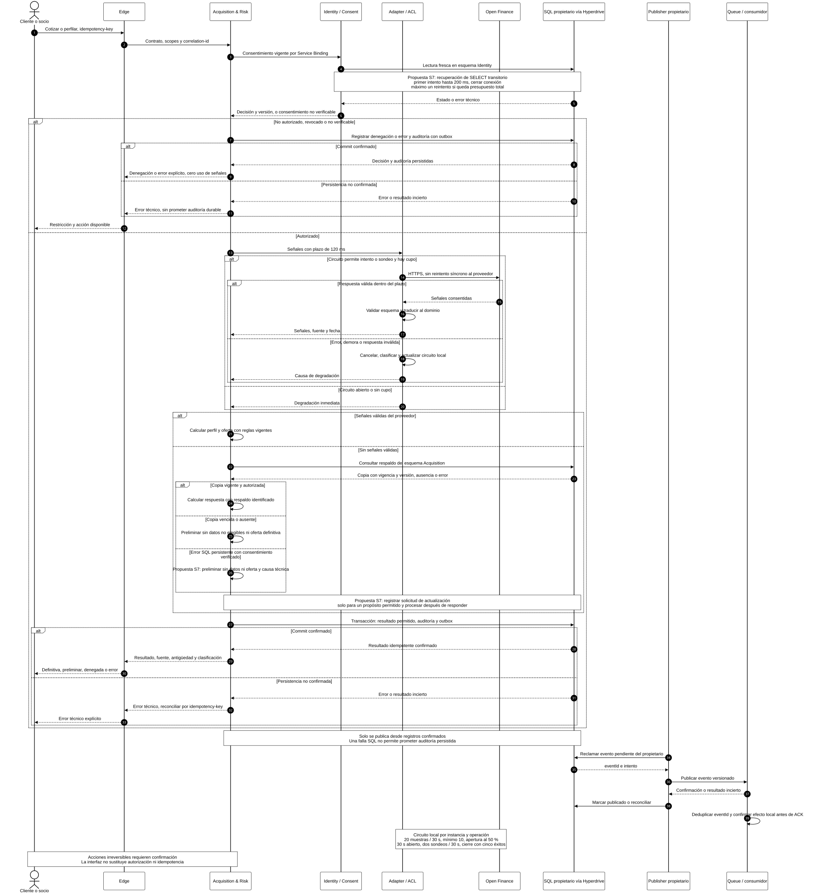
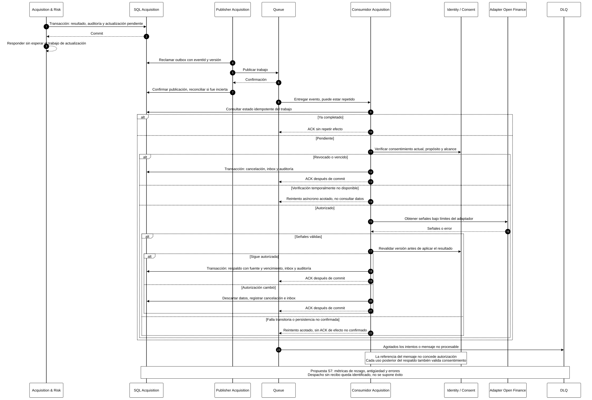
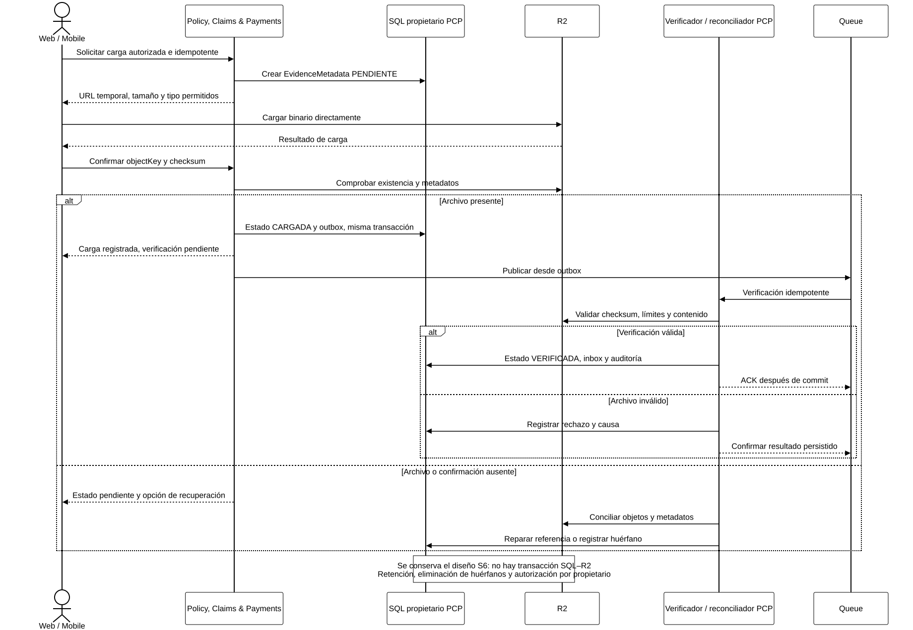

# Arquitectura de Solventa ajustada con los resultados de Semana 7

Fecha: 20 de septiembre de 2026. Base: arquitectura de Semana 6 y modelos de Lucidchart; evidencia: 30 corridas de EXP-S5-01. Se mantienen los tres servicios del producto, los canales web y móvil y los flujos de pólizas, pagos y siniestros.

La configuración evaluada no pasa todos los criterios simultáneamente. La decisión es conservar los mecanismos que contuvieron las fallas y ajustar las lecturas SQL, la frescura del respaldo y la auditoría. El [informe experimental](resultados.md) contiene los dictámenes y las cifras completas.

## Cambios derivados de la experimentación

| Evidencia | Decisión de diseño | Responsable y efecto esperado |
|---|---|---|
| E01: 25 degradadas entre 90.000 solicitudes; E05 r2: p99 de cotización de 556 ms | Mantener 120 ms para Open Finance. Incorporar recuperación acotada de lecturas SQL transitorias | Adaptadores SQL de Identity y Acquisition. Recuperar lecturas cuando quede tiempo; el reintento también consume presupuesto |
| E04: hasta 90,38 % de respuestas degradadas | Actualizar señales autorizadas mediante outbox y Queue | Acquisition obtiene y conserva respaldo reciente fuera de la solicitud del usuario |
| E05: reducción de 92,24–97,31 %; E09: seis resultados de desempeño no pasan | Conservar cortacircuitos local y registrar estado por instancia y operación | Adapter Open Finance. Evitar llamadas durante fallas; distinguir falta de tráfico de recuperación fallida |
| E06: 219 cierres con cinco éxitos, pico menor al 110 %; no pasa Wilson en perfilamiento r2 | Conservar la recuperación del circuito y gestionar errores de lectura | Identity bloquea si no verifica consentimiento; Acquisition informa un resultado preliminar cuando no dispone de señales elegibles |
| E07 y E08: cero uso de datos no elegibles | Mantener consentimiento fresco y comprobarlo también en el trabajo asíncrono | Identity autoriza; Acquisition comprueba propósito, vigencia y versión antes de usar el respaldo |
| 33 recibos no confirmados y diferencias entre cliente y servidor | Guardar resultado y auditoría en transacción local con outbox | Cada propietario registra su decisión; publicación idempotente y conciliación de despacho, recibo y cierre |

La recuperación SQL existe como opción diagnóstica; la actualización asíncrona y la auditoría integrada del producto son propuestas de implementación. El error de medición de sondeos sí quedó corregido: se utiliza el instante real del sondeo y se conservaron las métricas originales. Ningún cambio propuesto se presenta como una mejora de p99 ya obtenida.

## Modelos ajustados

La conexión a [Lucidchart](https://lucid.app/lucidchart/48598a5b-beb0-45f1-8f76-832056912678/edit) permitió consultar el documento, pero devolvió `canEdit: false`. Por ello, este paquete entrega las vistas completas en Mermaid y SVG para trasladarlas a Lucidchart; el original no se ha modificado.

Las cuatro primeras vistas conservan todos los nodos y conectores recuperados de las páginas 11, 15, 12 y 14 de Lucidchart. [procedencia.json](diagramas/procedencia.json) relaciona sus identificadores originales con los nuevos. Las adiciones están rotuladas «Propuesta S7». La interacción conserva los participantes y decisiones de la página 16 e incorpora las salidas ante error. Los modelos complementarios detallan actualización, auditoría y procesos ya incluidos en Semana 6.

### 1. Vista funcional

Acquisition & Risk mantiene cotización, perfilamiento, señales y ofertas; Identity, Consent & Ecosystem mantiene autorización y consentimiento; Policy, Claims & Payments mantiene emisión, pagos, siniestros e indemnizaciones. El nuevo consumidor pertenece a Acquisition y utiliza los puertos y repositorios de ese propietario. No se incorpora un cuarto servicio.

[Fuente Mermaid](diagramas/01-funcional.mmd).

### 2. Estructura hexagonal

La recuperación SQL pertenece al adaptador de persistencia. La actualización asíncrona es un caso de uso de Acquisition invocado por el consumidor. El dominio conserva sus reglas sin depender de Cloudflare ni del modelo del proveedor. Los contratos públicos y de eventos permanecen versionados.

[Fuente Mermaid](diagramas/02-hexagonal.mmd).

### 3. Despliegue

Se conservan Workers, Hyperdrive, CockroachDB, Queues, Workflows y R2. El consumidor de actualización y el publicador se ejecutan dentro del Worker Acquisition. Los roles SQL siguen separados por propietario. El modelo multirregional corresponde al objetivo de producción; el laboratorio usó CockroachDB Basic en us-east-1 y carga desde Bogotá.

[Fuente Mermaid](diagramas/03-despliegue.mmd).

### 4. Información y propiedad de datos

Acquisition incorpora fuente, fecha de captura, vencimiento y versión de consentimiento al respaldo; registra la solicitud de actualización y la auditoría del resultado. Identity conserva la autorización como fuente de verdad. Un mensaje que contiene una referencia de consentimiento no concede permiso por sí solo. Se mantienen cotizaciones, ofertas, pólizas, pagos, siniestros, evidencias, indemnizaciones y los registros outbox/inbox de cada propietario.

[Fuente Mermaid](diagramas/04-informacion.mmd).

### 5. Interacción de cotización y perfilamiento

El recorrido valida consentimiento antes de acceder a señales. Se separan resultado definitivo, respaldo, preliminar, denegación y error técnico. Una escritura no confirmada se informa como error; no se promete persistencia de auditoría cuando falla la base de datos. Las acciones irreversibles conservan autorización, confirmación e idempotencia.

[Fuente Mermaid](diagramas/05-interaccion.mmd).

### 6. Actualización y auditoría asíncronas

El resultado y la solicitud de trabajo se confirman en una transacción local. El publicador entrega el evento a Queue; el consumidor comprueba consentimiento, deduplica y confirma el mensaje después de persistir el efecto. La versión se revalida antes de aplicar las señales y cada uso posterior vuelve a comprobar autorización. Los errores persistentes pasan a la cola de mensajes fallidos para revisión.

[Fuente Mermaid](diagramas/06-actualizacion-auditoria.mmd).

### 7. Evidencia binaria

Se conserva la carga directa a R2 y los estados PENDIENTE, CARGADA y VERIFICADA del propietario Policy. Un objeto cargado no equivale a evidencia verificada. La conciliación resuelve archivos huérfanos y confirmaciones ausentes; no existe una transacción distribuida entre R2 y SQL.

[Fuente Mermaid](diagramas/07-evidencias-r2.mmd).

### 8. Procesos contractuales y consistencia

Se mantienen firma, emisión, pagos, siniestros e indemnización, con Workflows, outbox/inbox e idempotencia. Ante un efecto financiero incierto se concilia antes de repetir. Los objetivos regionales se conservan dentro del diseño; no se atribuyen al ensayo de Open Finance.

[Fuente Mermaid](diagramas/08-procesos-contractuales.mmd).

## Parámetros y reglas de implementación

| Mecanismo | Regla |
|---|---|
| Open Finance | Plazo de 120 ms; cancelación; sin reintentos síncronos encadenados |
| Circuito local | Hasta 20 muestras en 30 s; mínimo 10; abre al 50 % de fallas; 30 s abierto; dos sondeos por 30 s; cierra con cinco éxitos |
| Recuperación SQL propuesta | Solo SELECT idempotente y error transitorio permitido; primer intento hasta 200 ms; cerrar conexión; máximo un reintento con espera de 10–25 ms si cabe en 700 ms totales |
| Presupuesto de reintentos | Por instancia y dependencia: ráfaga de dos y reposición de cinco por segundo; no reintentar escrituras ni errores de autorización |
| Consentimiento | Lectura fresca; no verificable implica bloqueo. Dinero, autorización y estado contractual no dependen de cachés permisivas |
| Respaldo | Fuente, capturedAt, expiresAt y consentVersion; sin oferta definitiva basada en datos no elegibles |
| Persistencia y mensajería | Agregado, auditoría y outbox en transacción local. Consumidor con eventId y efecto local atómicos; ACK después de commit |
| Trazabilidad | Identificador extremo a extremo; distinguir recepción, despacho, cancelación y cierre; los hechos desconocidos se mantienen explícitos |

El límite de 700 ms es una barrera de ejecución, no el objetivo normal de latencia. Las pruebas diagnósticas SQL registraron respuestas de hasta 836 ms. El cierre de conexiones y la respuesta de extremo a extremo deben presupuestarse: la propuesta no garantiza por sí sola p99 ≤ 500 ms.

## Incorporación a Proyecto Final 2

| Trabajo | Resultado de implementación esperado |
|---|---|
| Gestión de lecturas en Identity y Acquisition | Error clasificado por etapa, cancelación y recuperación permitida sin omitir autorización |
| Respaldo actualizado en Acquisition | Trabajo idempotente, nueva validación de consentimiento y copia con origen y vencimiento |
| Auditoría del propietario | Resultado y evento persistidos juntos; recuperación de publicación y conciliación de registros |
| Estados en web y móvil | Fuente y antigüedad visibles; distinguir preliminar, definitiva, denegada y error |

Estas decisiones corrigen debilidades concretas manteniendo la arquitectura escogida. El experimento respalda la contención de fallas y el control de uso de datos; los incumplimientos guían las tareas anteriores.

## Referencias y términos

La entrega de Queue admite duplicados, por lo que el consumidor debe ser idempotente. [Cloudflare: garantías de entrega](https://developers.cloudflare.com/queues/reference/delivery-guarantees/). La lectura de consentimiento debe usar la configuración sin caché para obtener el estado fresco. [Cloudflare: caché de consultas de Hyperdrive](https://developers.cloudflare.com/hyperdrive/concepts/query-caching/).

Outbox: registros pendientes de publicar en la base del propietario. Inbox: identificadores procesados que impiden repetir efectos. Consumidor idempotente: procesar dos veces el mismo mensaje produce un solo efecto. DLQ: cola que conserva mensajes que agotaron sus intentos. Propietario: servicio autorizado a modificar un conjunto de datos. El [glosario del informe](resultados.md#glosario) explica los términos del laboratorio.
