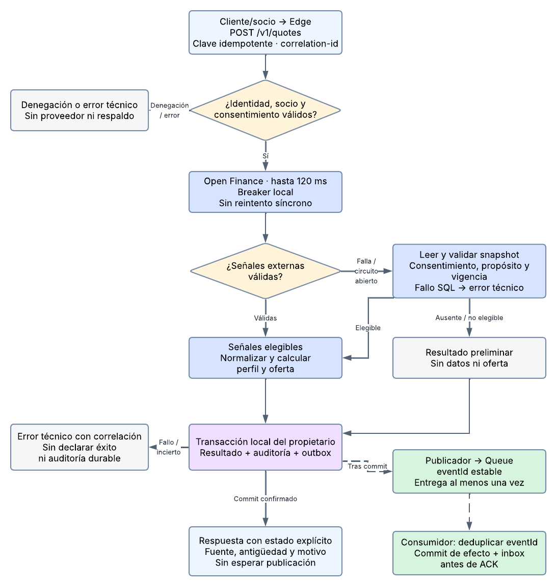

# Catálogo de modelos y decisiones de arquitectura

La [arquitectura final de Semana 7](arquitectura-s7.md) contiene 10 secciones principales, nueve tablas y once figuras del documento de entrega. También está disponible como [Google Doc](https://docs.google.com/document/d/1BFg3RyFkN_HhRrEfmrd5rTXi0I6fseI1gssDeygQ1Rw/edit). [PDF de entrega revisado](https://drive.google.com/file/d/1713qHIL4C8yKortSbukF5MvtoOQl-gnX/view). Este catálogo reúne las fuentes editables y vistas complementarias.

Fecha: 20 de septiembre de 2026. Base: arquitectura de Semana 6 y modelos de Lucidchart; evidencia: 30 corridas de EXP-S5-01. Se mantienen los tres servicios del producto, los canales web y móvil y los flujos de pólizas, pagos y siniestros.

La configuración evaluada no pasa todos los criterios simultáneamente. La decisión es conservar los mecanismos que contuvieron las fallas y ajustar las lecturas SQL, la frescura del respaldo y la auditoría. El [informe experimental](resultados.md) contiene los dictámenes y las cifras completas.

## Cambios derivados de la experimentación

| Evidencia | Decisión de diseño | Responsable y efecto esperado |
|---|---|---|
| E01: 25 degradadas entre 90.000 solicitudes; E05 r2: p99 de cotización de 556 ms | Mantener 120 ms para Open Finance. Incorporar recuperación acotada de lecturas SQL transitorias | Adaptadores SQL de Identity y Acquisition. Recuperar lecturas cuando quede tiempo; el reintento también consume presupuesto |
| E04: hasta 90,38 % de respuestas degradadas | Actualizar señales autorizadas mediante outbox y Queue | Acquisition obtiene y conserva respaldo reciente fuera de la solicitud del usuario |
| E05: reducción de 92,24–97,31 %; E09: seis resultados de desempeño no pasan | Conservar cortacircuitos local y registrar estado por instancia y operación | Adapter Open Finance. Evitar llamadas durante fallas; distinguir falta de tráfico de recuperación fallida |
| E06: 219 cierres con cinco éxitos, pico menor al 110 %; no pasa Wilson en perfilamiento r2 | Conservar la recuperación del circuito y gestionar errores de lectura | Identity bloquea si no verifica consentimiento; Acquisition informa un resultado preliminar cuando no dispone de señales elegibles |
| E07 y E08: cero uso de datos no elegibles | Mantener consentimiento fresco y comprobarlo también en el trabajo asíncrono | Identity autoriza; Acquisition comprueba propósito, vigencia y versión antes de usar el respaldo |
| 33 recibos no confirmados y diferencias entre cliente y servidor | Guardar resultado y auditoría en transacción local con outbox | Cada propietario registra su decisión; publicación idempotente y conciliación de despacho, recibo y cierre |

La recuperación SQL existe como opción diagnóstica; la actualización asíncrona y la auditoría integrada del producto son propuestas de implementación. El error de medición de sondeos sí quedó corregido: se utiliza el instante real del sondeo y se conservaron las métricas originales. Ningún cambio propuesto se presenta como una mejora de p99 ya obtenida.

## Modelos ajustados

Las vistas finales se mantienen en Lucidchart. Se editaron las páginas originales confirmadas por el usuario, conservando sus componentes, conexiones y convenciones visuales. Las nuevas secuencias detallan las propuestas de Semana 7. [Procedencia de las figuras](diagramas/procedencia-s7.json).

El despliegue conserva la figura de Semana 6: los ajustes se ejecutan dentro de los Workers existentes. Su página editable no fue identificada entre los enlaces proporcionados. Los Mermaid y SVG anteriores se conservan como antecedentes; no representan las figuras finales de esta entrega.

### 1. Vista funcional

[Abrir diagrama editable en Lucidchart](https://lucid.app/lucidchart/48598a5b-beb0-45f1-8f76-832056912678/edit?page=sD2rkI0wiboS).

### 2. Estructura hexagonal

[Abrir diagrama editable en Lucidchart](https://lucid.app/lucidchart/48598a5b-beb0-45f1-8f76-832056912678/edit?page=JVnrTKTer72h).

### 3. Flujo de control del recorrido principal

[Abrir diagrama editable en Lucidchart](https://lucid.app/lucidchart/48598a5b-beb0-45f1-8f76-832056912678/edit?page=~VbwroApN__Y).

### 4. Despliegue conservado de Semana 6

### 5. Información y propiedad de datos

[Abrir diagrama editable en Lucidchart](https://lucid.app/lucidchart/48598a5b-beb0-45f1-8f76-832056912678/edit?page=uWnrQ4I3Be9m).

### 6. Flujo de cotización

[Abrir diagrama editable en Lucidchart](https://lucid.app/lucidchart/ccffee59-dde0-4ee9-97c4-ecdf283c37ac/edit?page=quote).

### 7. Publicación y consumo

[Abrir diagrama editable en Lucidchart](https://lucid.app/lucidchart/ccffee59-dde0-4ee9-97c4-ecdf283c37ac/edit?page=events).

### 8. Evidencia binaria

[Abrir diagrama editable en Lucidchart](https://lucid.app/lucidchart/ccffee59-dde0-4ee9-97c4-ecdf283c37ac/edit?page=evidence).

### 9. Interacción de cotización y perfilamiento

[Abrir diagrama editable en Lucidchart](https://lucid.app/lucidchart/48598a5b-beb0-45f1-8f76-832056912678/edit?page=.Wnrt7v3wcNm).

### 10. Actualización y auditoría asíncronas

[Abrir diagrama editable en Lucidchart](https://lucid.app/lucidchart/48598a5b-beb0-45f1-8f76-832056912678/edit?page=j.awHeLs8s6r).

### 11. Recuperación acotada de SELECT

[Abrir diagrama editable en Lucidchart](https://lucid.app/lucidchart/48598a5b-beb0-45f1-8f76-832056912678/edit?page=U-awjyDsvcRs).

## Parámetros y reglas de implementación

| Mecanismo | Regla |
|---|---|
| Open Finance | Plazo de 120 ms; cancelación; sin reintentos síncronos encadenados |
| Circuito local | Hasta 20 muestras en 30 s; mínimo 10; abre al 50 % de fallas; 30 s abierto; dos sondeos por 30 s; cierra con cinco éxitos |
| Recuperación SQL propuesta | Solo SELECT idempotente y error transitorio permitido; primer intento hasta 200 ms; cerrar conexión; máximo un reintento con espera de 10–25 ms si cabe en 700 ms totales |
| Presupuesto de reintentos | Por instancia y dependencia: ráfaga de dos y reposición de cinco por segundo; no reintentar escrituras ni errores de autorización |
| Consentimiento | Lectura fresca; no verificable implica bloqueo. Dinero, autorización y estado contractual no dependen de cachés permisivas |
| Respaldo | Fuente, capturedAt, expiresAt y consentVersion; sin oferta definitiva basada en datos no elegibles |
| Persistencia y mensajería | Agregado, auditoría y outbox en transacción local. Consumidor con eventId y efecto local atómicos; ACK después de commit |
| Trazabilidad | Identificador extremo a extremo; distinguir recepción, despacho, cancelación y cierre; los hechos desconocidos se mantienen explícitos |

El límite de 700 ms es una barrera de ejecución, no el objetivo normal de latencia. Las pruebas diagnósticas SQL registraron respuestas de hasta 836 ms. El cierre de conexiones y la respuesta de extremo a extremo deben presupuestarse: la propuesta no garantiza por sí sola p99 ≤ 500 ms. Adoptar el SELECT de hasta 200 ms queda condicionado a resolver en refinamiento la interpretación del criterio de 120 ms, conforme al plan de Proyecto Final 2.

## Incorporación a Proyecto Final 2

| Trabajo | Resultado de implementación esperado |
|---|---|
| Gestión de lecturas en Identity y Acquisition | Error clasificado por etapa, cancelación y recuperación permitida sin omitir autorización |
| Respaldo actualizado en Acquisition | Trabajo idempotente, nueva validación de consentimiento y copia con origen y vencimiento |
| Auditoría del propietario | Resultado y evento persistidos juntos; recuperación de publicación y conciliación de registros |
| Estados en web y móvil | Fuente y antigüedad visibles; distinguir preliminar, definitiva, denegada y error |

Estas decisiones corrigen debilidades concretas manteniendo la arquitectura escogida. El experimento respalda la contención de fallas y el control de uso de datos; los incumplimientos guían las tareas anteriores.
