# Resultados y análisis experimental de Solventa  Semana 7

Solventa necesita consultar señales financieras para cotizar y perfilar. El problema estudiado es qué ocurre cuando esa fuente tarda demasiado, falla o deja de estar disponible: esperar puede bloquear la respuesta; usar un respaldo puede reducir su calidad; usar datos sin autorización sería inaceptable.

Construimos y ejecutamos un banco de pruebas para evaluar la espera máxima al proveedor, el cortacircuitos y el respaldo autorizado en cotización y perfilamiento. La campaña completó 30 corridas. Los resultados justifican conservar estos mecanismos y corregir incumplimientos concretos de latencia, completitud y trazabilidad. El informe presenta el dictamen de cada escenario y las acciones de arquitectura derivadas de la evidencia.

El lote s7-inicial-20260914-122029 terminó el 14 de septiembre de 2026 a las 20:42:26 de Bogotá. Se analizan 899.835 solicitudes emitidas durante medición: 899.033 completas y 802 no completas. Estas últimas incluyen 793 clasificadas como error técnico y nueve con otra clasificación original, pero sin completitud verificable. No se suman al denominador las 205 iteraciones que el generador no emitió: 165 corresponden a medición y 40 a calentamiento.

### Estructura del informe

La sección 1 presenta el montaje, los criterios y la ubicación de las evidencias. La sección 2 establece qué pasa y qué no pasa en los escenarios ejecutados. La sección 3 explica las incidencias y las correcciones realizadas. La sección 4 define las medidas de arquitectura. La sección 5 recoge la decisión final y su incorporación al proyecto.

La experimentación se cierra con las 30 corridas realizadas, por decisión de terminar la campaña y concentrar el cierre en los resultados obtenidos. Se cancela la ejecución adicional de E10, E11 y las repeticiones propuestas. Esta decisión modifica el alcance de ejecución previsto en el protocolo S5; no modifica sus umbrales ni acredita su aceptación formal. Se conservan los resultados originales, los inconclusos y las gráficas obtenidas de registros reales. El cierre documental y las propuestas para el producto no equivalen a una nueva campaña de confirmación.

## 1. Contexto y metodología

### 1.1. Decisión arquitectónica evaluada

El experimento EXP-S5-01 cubre dos operaciones: cotización y perfilamiento. La primera debe responder a la solicitud de cotización; la segunda obtiene el perfil a partir de las señales permitidas. Ambas dependen de Open Finance, representado aquí por un simulador que permite controlar su demora y sus errores. No se usaron bancos reales ni datos personales de clientes.

La solución evaluada tiene cuatro partes. El adaptador traduce la respuesta externa al formato de Solventa. El límite de espera cancela una consulta demasiado lenta. El cortacircuitos (circuit breaker) deja de llamar temporalmente a la dependencia cuando acumula fallas y luego realiza consultas de prueba para comprobar si se recuperó. El respaldo (fallback) usa una copia de datos vigente y autorizada, llamada snapshot, o entrega una respuesta degradada sin oferta definitiva. Si no hay consentimiento válido, debe denegar el uso del dato.

Evaluamos si el sistema respondía dentro del tiempo previsto, entregaba una respuesta completa y clasificable, respetaba el consentimiento y permitía seguir cada solicitud entre los componentes. Estos requisitos corresponden al desempeño y la seguridad definidos en el protocolo.

### 1.2. Diseño y ejecución de las pruebas

El banco tiene tres servicios en Cloudflare Workers: Acquisition recibe las solicitudes, Identity verifica el consentimiento y Simulator representa al proveedor de Open Finance. Dos conexiones Hyperdrive enlazan los servicios con CockroachDB Basic, en AWS us-east-1, sin caché de consultas. El generador k6 se ejecutó desde Bogotá.

Cada corrida configuró 100 solicitudes por segundo: 70 de cotización y 30 de perfilamiento, con datos sintéticos y semilla 4501 para hacer reproducibles las condiciones. Antes de medir se ejecutaron 120 segundos de calentamiento; la medición duró 300 segundos. Cada condición se repitió tres veces. E07 se ejecutó con respaldo ausente y vencido por separado: por eso nueve códigos de escenario producen diez condiciones y 30 corridas.

E05 y E09 comienzan con calentamiento sano y activan la caída al iniciar la medición. E06 añade 60 segundos de caída después del calentamiento y empieza a medir cuando el proveedor vuelve a funcionar. En E03 y E04 la degradación ya existe durante el calentamiento; esa diferencia importa al interpretar sus tiempos.
Las 16 ejecuciones conservadas en Semana 6 son antecedentes separados. Sus fallos motivaron correcciones de conciliación, cancelación y persistencia de evidencia antes del lote S7. Este informe evalúa las 30 corridas identificadas en el registro S7 y no combina ambas cohortes como 46 repeticiones homogéneas. Las correcciones anteriores no prueban que hayan desaparecido todas las incidencias.

### 1.3. Métricas y criterios de evaluación

La latencia de extremo a extremo mide cuánto espera el cliente desde que envía la solicitud hasta que recibe la respuesta. El p95 es el tiempo que no supera el 95 % de las solicitudes; el p99 hace lo mismo para el 99 % y permite detectar una minoría de respuestas lentas. Evaluamos ambos percentiles por separado del promedio.

La completitud técnica cuenta respuestas con contenido y correlación verificables. Incluye respuestas normales, degradadas y denegaciones de negocio esperadas; excluye tiempos agotados, errores técnicos y respuestas sin evidencia suficiente. Por tanto, una denegación segura puede ser técnicamente completa aunque no entregue una oferta.

El intervalo de Wilson incorpora la incertidumbre de la muestra. Se exige que su límite inferior, con confianza del 95 %, alcance 99,9 % por operación y repetición. El cálculo se realiza por operación y repetición, sin combinar escenarios. Los límites fueron establecidos antes de ejecutar:

| Criterio por operación y repetición |Cotización |Perfilamiento |
| --- |--- |--- |
| p95 de extremo a extremo |≤ 250 ms |≤ 400 ms |
| p99 de extremo a extremo |≤ 500 ms |≤ 800 ms |
| Límite inferior de Wilson, confianza 95 % |≥ 0,999 |≥ 0,999 |

Además de esos umbrales, E01 exige cero uso de respaldo y E02 menos del 5 %. E05 exige apertura en 30 segundos, control de sondeos y al menos 80 % de reducción de llamadas frente a E09. E06 exige recuperación tras cinco éxitos, sin reapertura durante dos minutos, y un pico de llamadas no mayor al 110 % de la tasa previa. E07 y E08 exigen no utilizar datos no elegibles.

La configuración medida limita a 120 milisegundos la espera al proveedor, a 700 milisegundos la ejecución del servicio y a dos segundos la espera del cliente. El circuito decide por proceso aislado (isolate) y operación: considera hasta 20 muestras en 30 segundos, necesita al menos diez y abre con 50 % de fallas. Después de 30 segundos abierto permite dos sondeos por ventana de 30 segundos y cierra tras cinco éxitos consecutivos.

El dictamen final usa “Pasa” cuando los datos cumplen el objetivo evaluado y “No pasa” cuando muestran un incumplimiento. Se separan desempeño, utilidad de la respuesta, seguridad y trazabilidad: un recibo ausente no convierte automáticamente una respuesta completa en error del usuario, pero incumple la trazabilidad si se exige reconstruirla. Los estados automáticos originales —Criterios básicos cumplidos, Ajustar e Inconcluso— permanecen en las evidencias; los dictámenes de este informe identifican expresamente el criterio juzgado y no reclasifican esos archivos.

### 1.4. Organización de las evidencias

Cada escenario presenta el objetivo, los resultados y la decisión de arquitectura. Las figuras se integran junto al análisis correspondiente. Para revisar las 30 corridas individualmente, el registro de evidencias conserva los estados originales y recalculados, las imágenes y los enlaces a los archivos.

[Carpeta de evidencias experimentales](https://drive.google.com/drive/folders/11Mw4NfLJkKveZMJeMDr9IgAThBlqIuGO) · [Solventa - Registro de evidencias experimentales - Semana 7](https://docs.google.com/document/d/1Cxkaju0-vVX4Cm03mNZrDtWN5-GNgggsB5sbOqZfKbM/edit) · [Paquete de respaldo](https://drive.google.com/file/d/1GF7b2SNPBP9VaVHPl2Pp00X5DAMl3wzK/view)

Las tablas y gráficas se calcularon desde los resultados exportados: métricas por corrida para desempeño; incidencias para respuestas incompletas; comparación E05/E09 para llamadas evitadas; recuperación para cierres y picos; sondeos para la corrección del analizador. Las cinco capturas de Cloudflare documentan ejemplos reales de E03 repetición 1; corresponden a esa corrida.

Una captura permite ver una observación; los archivos por corrida permiten comprobar el resultado. El paquete histórico de Drive conserva configuración, análisis originales y derivados, figuras y huellas de integridad. La [versión pública laboratorio-s7](https://github.com/AlejandroForeroG/solventa-laboratorio/releases/tag/laboratorio-s7) del repositorio Solventa distribuye los 30 ZIP con registros crudos, SHA256SUMS y manifest.json para reproducir el cálculo completo; no es una campaña nueva.

## 2. Resultados experimentales

### 2.1. Resumen de resultados

Se completaron tres repeticiones de E01 a E09 y ambas variantes de E07: 30 corridas y 60 resultados por operación y repetición. La decisión final se toma con esta campaña. E10 y E11 quedan cancelados.

Pasan los objetivos medidos de E02, E03, E04, E07 ausente, E07 vencido y E08. E01 no pasa la exigencia de cero respaldo; E05 no pasa todos sus criterios por el p99 de cotización y la apertura por grupo; E06 no pasa la completitud de perfilamiento en su segunda repetición; E09 no pasa desempeño y completitud sin circuito. Estos dictámenes se explican por criterio a continuación. La trazabilidad total se evalúa por separado y no pasa por los registros faltantes.

El análisis original clasificó 12 corridas con criterios básicos cumplidos, cuatro para ajustar y 14 inconclusas. Identificamos después un error en la forma de medir los sondeos y lo corregimos mediante un recálculo trazable: solo E04 repetición 1 y E06 repetición 3 cambian de “Ajustar” a “Criterios básicos cumplidos”. Después del recálculo quedan 14 corridas con criterios básicos cumplidos, dos para ajustar y 14 inconclusas. La sección 3 explica la corrección y por qué no resuelve las demás fallas.

Las tablas muestran la mediana y el peor p95 entre tres repeticiones, el peor p99 y el menor Wilson. No se calculan percentiles mezclando escenarios. La suma de completas/emitidas es descriptiva; las decisiones se mantienen por repetición. El archivo metricas.csv conserva los 60 resultados individuales, incluidos los inconclusos.

### Cotización

| Condición |Completas / emitidas |p95 mediana ms |p95 peor ms |p99 peor ms |Wilson mínimo |
| --- |--- |--- |--- |--- |--- |
| E01 |62999/63000 |153,00 |155,00 |172,00 |99,9730 % |
| E02 |62998/62999 |214,00 |219,00 |241,00 |99,9730 % |
| E03 |62998/63000 |166,00 |171,00 |267,00 |99,9730 % |
| E04 |62995/63001 |184,00 |184,00 |216,00 |99,9510 % |
| E05 |62994/63000 |218,00 |238,00 |556,00 |99,9377 % |
| E06 |62989/62999 |155,00 |158,00 |172,00 |99,9124 % |
| E07 ausente |63000/63001 |162,00 |165,00 |191,00 |99,9730 % |
| E07 vencido |62999/63001 |165,00 |179,00 |359,00 |99,9730 % |
| E08 revocado |62998/63001 |110,00 |111,00 |125,00 |99,9653 % |
| E09 |62322/62873 |317,00 |369,00 |2000,00 |98,4618 % |

### Perfilamiento

| Condición |Completas / emitidas |p95 mediana ms |p95 peor ms |p99 peor ms |Wilson mínimo |
| --- |--- |--- |--- |--- |--- |
| E01 |27000/27000 |154,00 |155,00 |171,00 |99,9573 % |
| E02 |26999/27000 |214,00 |214,00 |232,00 |99,9371 % |
| E03 |26998/26999 |169,10 |178,00 |272,00 |99,9371 % |
| E04 |27000/27001 |179,00 |183,00 |219,00 |99,9371 % |
| E05 |26996/27000 |221,00 |232,00 |531,02 |99,9020 % |
| E06 |26995/26999 |156,00 |157,00 |171,00 |99,8858 % |
| E07 ausente |26998/27000 |165,00 |166,00 |191,00 |99,9190 % |
| E07 vencido |26999/26999 |174,00 |181,00 |358,01 |99,9573 % |
| E08 revocado |27000/27001 |109,00 |111,00 |122,00 |99,9371 % |
| E09 |26756/26961 |324,00 |371,80 |2000,00 |98,5616 % |

Ocho de los 60 resultados individuales incumplen al menos un umbral de latencia o Wilson: ambas operaciones de las tres E09, cotización de E05 r2 y perfilamiento de E06 r2. Los otros 52 cumplen los umbrales de latencia y Wilson. La trazabilidad y los criterios funcionales se evalúan en cada escenario. Las figuras 1–4 muestran los resultados por repetición.

### Figura 4 Completitud técnica por operación y repetición

Cada celda usa su propio numerador y denominador. El gris marca incumplimiento de 99,9 %; no se agregan corridas para superar el umbral.

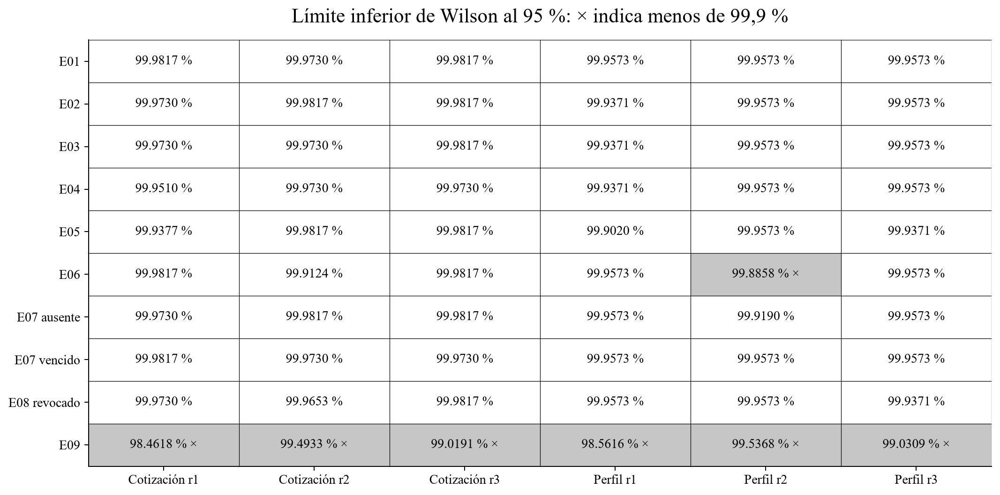

### 2.2. Análisis por escenario

### E01. Operación con proveedor sano

Objetivo. Se configuró el proveedor con 40 milisegundos de demora y cero errores. Esperábamos cumplir los límites de latencia y completitud sin usar respaldo. Esta línea base permite detectar degradaciones causadas por el recorrido de Solventa o por su infraestructura aun cuando no se inyectan fallas al proveedor.

Resultados y dictamen: No pasa la condición de cero respaldo; pasan latencia y completitud. En 90.000 solicitudes hubo 25 respuestas degradadas (0,0278 %) y un error técnico (0,0011 %). Los percentiles y Wilson cumplen en ambos servicios. El incumplimiento es de baja frecuencia y afecta la disponibilidad de señales actuales; no representa una caída general. Evidencia: tablas E01, figura 1 y archivos de las tres repeticiones.

Decisión de arquitectura. Conservar el adaptador, el plazo de 120 ms y el respaldo autorizado. Las 25 degradaciones no justifican sustituir la plataforma. La mejora se concentra en gestionar las esperas de las lecturas SQL y registrar por separado la causa del respaldo. Una lectura transitoria podrá recuperarse con un intento adicional dentro del tiempo disponible; si la demora persiste, la respuesta indicará el error. El aumento del plazo del proveedor no se adopta como solución automática.

### E02. Latencia cercana al tiempo límite

Objetivo. El proveedor tarda 100 milisegundos frente a un plazo de 120. Se esperaba menos del 5 % de respaldo y cumplimiento de los límites de ambos servicios. Este caso mide si una respuesta externa válida se pierde por un margen de espera demasiado estrecho.

Resultados y dictamen: Pasa el objetivo de latencia, completitud y respaldo inferior al 5 %. La mayor proporción de respaldo fue 0,0667 % por operación y repetición, muy inferior al límite. Las tres corridas conservan su estado automático Inconcluso por recibos no confirmados; esa incidencia pertenece a la trazabilidad, no elimina el desempeño medido desde el cliente. Evidencia: tablas E02, figura 1 y conciliación por corrida.

Decisión de arquitectura. Mantener 120 ms para el adaptador: en el escenario de 100 ms el margen observado permite cumplir los objetivos y evita aumentar la espera normal. Conservar el registro del intento, la cancelación y el resultado de negocio para diferenciar una respuesta degradada de una falla técnica.

### E03. Respuesta ante un proveedor lento

Objetivo. Se configuraron 300 milisegundos de demora, por encima del plazo de 120. Esperábamos cancelar la consulta lenta, clasificar la respuesta y mantener los percentiles mediante respaldo autorizado o denegación controlada.

Resultados y dictamen: Pasa la contención de un proveedor lento. Las tres repeticiones cumplen los criterios básicos y los límites de latencia y completitud. El peor p95 fue 171 ms en cotización y 178 ms en perfilamiento. Predominan las respuestas degradadas, coherentes con un proveedor de 300 ms y un límite de 120 ms. Evidencia: tablas E03, figura 1 y capturas 10 a 14.

Decisión de arquitectura. Conservar cancelación, circuito y respaldo autorizado: impiden trasladar toda la demora del proveedor al usuario. La respuesta debe informar fuente, antigüedad y carácter preliminar. E03 evalúa una lentitud ya presente en el calentamiento; la transición desde operación sana se analiza en E05.

### Figura 1 Latencia: E01, E02, E03

Los percentiles proceden de la medición del cliente. Los estados automáticos y las incidencias de conciliación se conservan en los archivos por corrida.

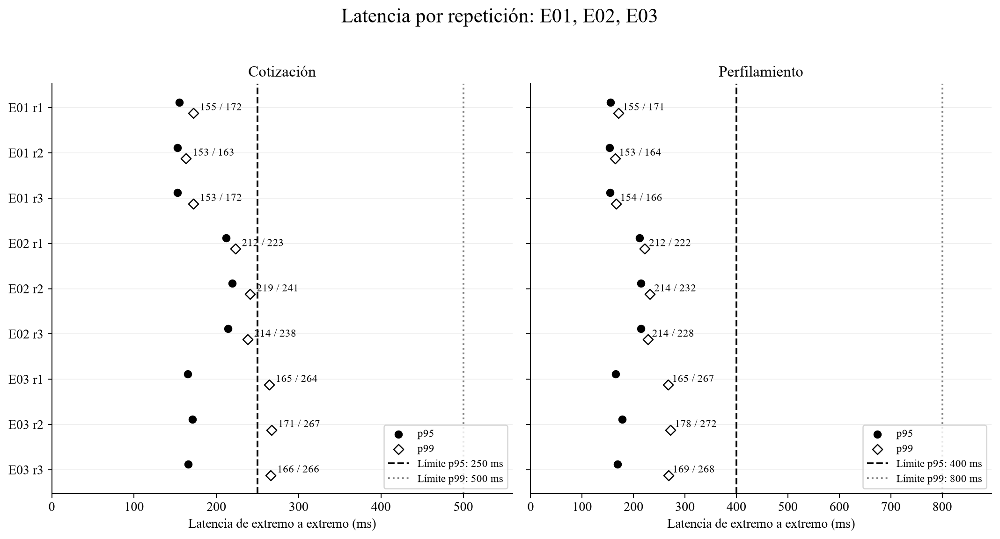

### E04. Fallas parciales del proveedor

Objetivo. Se inyectó 30 % de errores al proveedor. Esperábamos completitud, percentiles dentro del límite y degradación explícita. Este escenario no fue diseñado para juzgar el objetivo de reducción del 80 %, que corresponde a E05 frente a E09.

Resultados y dictamen: Pasa latencia, completitud y degradación explícita ante fallas parciales. Se degrada entre 85,88 % y 87,22 % de las cotizaciones y entre 88,98 % y 90,38 % de los perfiles. No se fijó un máximo de degradación para E04; por tanto, no se añade después como criterio de rechazo. Con esa frecuencia de respaldo se obtienen menos señales actuales del proveedor. Evidencia: tablas E04, figura 2 y clasificaciones por corrida.

Decisión de arquitectura. Mantener la protección y complementar el respaldo con actualización asíncrona de señales autorizadas en Acquisition & Risk. Una solicitud de actualización se registrará en el outbox del propietario y se procesará mediante Queue, con deduplicación y nueva comprobación de consentimiento y vigencia. La respuesta inmediata indicará si es preliminar. Este cambio busca disponer de un respaldo más reciente sin encadenar reintentos al proveedor en la solicitud del usuario; añade procesamiento y almacenamiento y se propone para la implementación.

### Figura 2 Latencia: E04, E05, E06

Los percentiles proceden de la medición del cliente. El p99 de E05 r2 y la completitud de E06 r2 se juzgan contra sus metas originales.

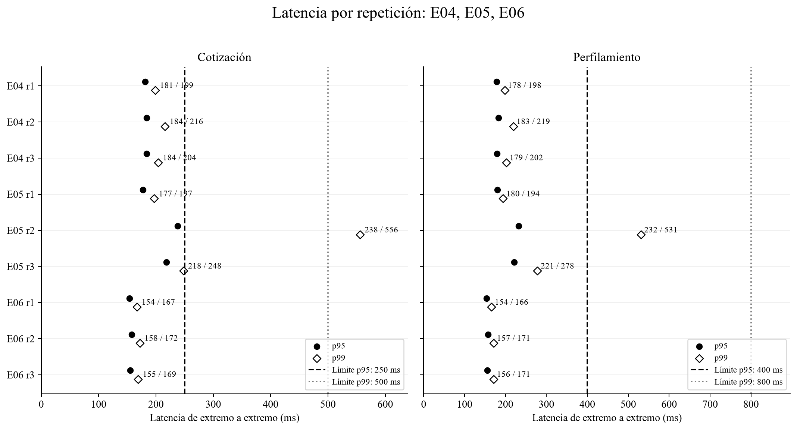

### E05 y E09. Caída total con y sin cortacircuitos

Objetivo. E05 activa un 100 % de errores durante cinco minutos con el circuito habilitado. E09 reproduce la misma caída con el circuito deshabilitado. E09 es un control: permite estimar cuántas llamadas se habrían realizado sin esa protección. Se esperaba que E05 abriera en un máximo de 30 segundos, respetara dos sondeos por proceso cada 30 segundos y evitara al menos el 80 % de las llamadas de E09.

Método de comparación. El segundo cero es el inicio de la medición y de la caída, después del calentamiento sano. Se cuentan las llamadas que el simulador realmente recibió desde el segundo 30 hasta antes del segundo 90. La reducción es uno menos el cociente entre llamadas de E05 y E09. Por ejemplo, 124 frente a 4.200 llamadas de cotización representan 97,05 % de reducción. Los tres pares comparten huellas de fuentes y configuración, salvo identificador, caso, habilitación del circuito y hora de inicio.

| Repetición |Operación |Recibos E05 |Recibos E09 |Reducción |
| --- |--- |--- |--- |--- |
| 1 |Cotización |124 |4200 |97,05 % |
| 1 |Perfilamiento |79 |1800 |95,61 % |
| 2 |Cotización |113 |4201 |97,31 % |
| 2 |Perfilamiento |68 |1800 |96,22 % |
| 3 |Cotización |326 |4201 |92,24 % |
| 3 |Perfilamiento |139 |1800 |92,28 % |

La reducción de llamadas pasa en las seis comparaciones: entre 92,24 % y 97,31 %, frente a una meta de 80 %. Cada ventana contiene 4.200 emisiones de cotización o 1.800 de perfilamiento por corrida. En esas ventanas no faltan registros API ni recibos de los despachos contabilizados; hay dos respuestas no completas en perfilamiento del tercer par. Se conservan en el CSV las diferencias de una llamada entre despacho y recepción en los bordes temporales.

Los pares se ejecutaron secuencialmente, con separaciones de 37,654 s, 47,594 s y 1.986,297 s (33,10 minutos). La comparación conserva esas diferencias y todos los incidentes del resto de la corrida. La reducción se calcula en las ventanas definidas, mientras que latencia y completitud se evalúan sobre toda la medición.

### Figura 7 Reducción de llamadas con cortacircuitos

Los seis pares superan la reducción objetivo del 80 %. Los errores de las corridas se conservan en el análisis de latencia, completitud y trazabilidad.

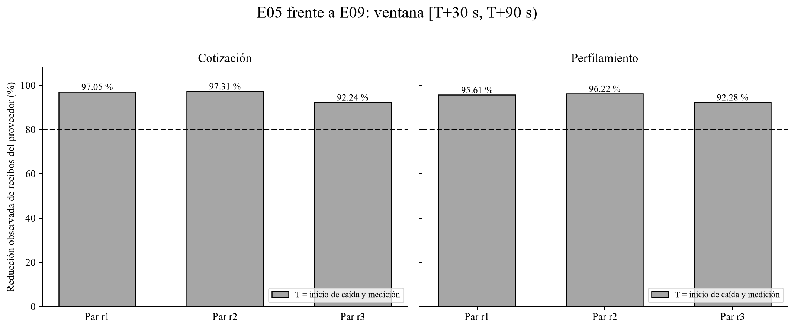

La apertura ≤ 30 s requiere examinar cada circuito local, no solamente la primera apertura del servicio. Se revisaron los grupos con tráfico medido y presencia durante calentamiento:

| Repetición |Operación |Grupos previos |Abrieron ≤ 30 s |Máxima apertura observada |
| --- |--- |--- |--- |--- |
| 1 |Cotización |47 |46 |87,937 s |
| 1 |Perfilamiento |25 |25 |9,965 s |
| 2 |Cotización |46 |46 |7,298 s |
| 2 |Perfilamiento |25 |25 |10,102 s |
| 3 |Cotización |33 |33 |12,524 s |
| 3 |Perfilamiento |19 |18 |11,504 s |

En E05 r1, un grupo de cotización reaparece a los 81,065 s y abre a los 87,937 s: tarda 6,872 s desde su primera solicitud medida, pero supera los 30 s desde la caída. El criterio de 30 s se mide desde la caída. En E05 r3, un grupo de perfilamiento recibe ocho solicitudes hasta los 8,114 s y deja de observarse sin apertura; no alcanza las diez muestras mínimas. Además, aparecen nuevos grupos después de iniciada la falla. Estos hechos son compatibles con estado local y distribución variable de tráfico; impiden afirmar apertura global y universal dentro de 30 s.

Dictamen E05: No pasa el conjunto de sus criterios. Sí pasa la reducción de llamadas; en cotización, la repetición 2 presenta p99 de 556 ms frente a 500 ms, un exceso de 56 ms (11,2 %), aunque p95 y Wilson cumplen. Tampoco se cumple una apertura de todos los grupos dentro de 30 s desde la caída. Dictamen E09: No pasa desempeño y completitud sin circuito; los seis resultados de operación y repetición incumplen los criterios numéricos. El resultado de E09 justifica conservar la protección.

Decisión de arquitectura. Conservar el circuito local y sus parámetros actuales. Su reducción observada supera el objetivo y no justifica añadir un coordinador global al recorrido síncrono. Para las demoras restantes, gestionar las lecturas de consentimiento y respaldo con cancelación y recuperación acotada; preparar señales autorizadas mediante trabajo asíncrono. Registrar el estado de cada circuito por instancia y operación para distinguir un grupo nuevo o sin tráfico de un fallo de recuperación.

### E06. Recuperación del proveedor

Objetivo. Después de 120 segundos sanos y 60 segundos de caída, el proveedor vuelve a responder en 40 milisegundos. Esperábamos que el circuito retomara las llamadas después de cinco consultas de prueba exitosas, no reabriera durante los dos minutos siguientes y no generara un pico superior al 110 % de la tasa previa.

Método de medición. El segundo cero es la restauración del proveedor. Cada grupo corresponde a un proceso aislado y una operación. Para estudiar recuperación se consideran los grupos que habían abierto durante la caída y volvieron a recibir tráfico durante la medición. Las figuras 8 y 9 muestran los cierres y el pico; la tabla conserva las diferencias por repetición.

| Rep. |Operación |Cierre/grupos acondicionados |Primer–último cierre s |Cierres con seguimiento 120 s/total |Pico/tasa previa |
| --- |--- |--- |--- |--- |--- |
| 1 |Cotización |47/47 |62,91–69,64 |47/47 |100,405 % |
| 1 |Perfilamiento |24/26 |62,84–79,65 |24/24 |100,639 % |
| 2 |Cotización |45/45 |63,25–93,43 |46/46 |100,429 % |
| 2 |Perfilamiento |28/29 |66,61–86,21 |28/28 |100,667 % |
| 3 |Cotización |46/49 |64,55–140,66 |44/47 |100,464 % |
| 3 |Perfilamiento |27/27 |63,84–90,14 |25/27 |100,695 % |

La recuperación registra 219 cierres y todos respetan cinco éxitos consecutivos. De 223 grupos acondicionados, 217 cierran; otros dos cierres corresponden a grupos fuera de ese denominador. Los seis restantes dejan de recibir tráfico entre 8,732 y 79,048 s después de la restauración. Se registran como grupos sin actividad posterior, no como seis fallas de recuperación demostradas.

### Figura 8 Cierre del circuito tras recuperación

El denominador contiene grupos con apertura registrada durante acondicionamiento y tráfico posterior. Ausencia de cierre observado no prueba por sí sola un circuito permanentemente abierto: puede cesar el tráfico del isolate.

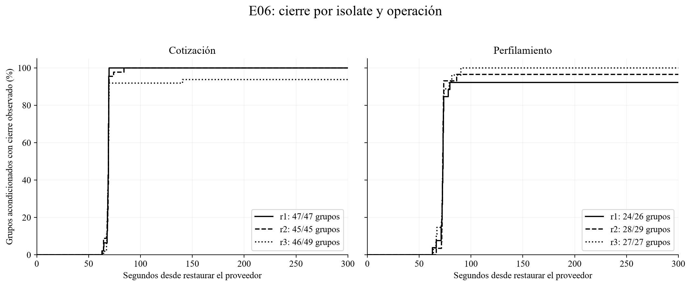

No se registraron reaperturas durante los 120 s posteriores a los cierres. Hay tráfico del mismo grupo hasta ese horizonte en 214 de los 219 cierres; los otros cinco pertenecen a E06 r3 y quedan identificados en el registro. La decisión de conservar el mecanismo se apoya en los cierres efectivos, la secuencia de cinco éxitos y el pico de llamadas medido.

Resultados y dictamen: No pasa la completitud de perfilamiento en E06 r2: Wilson 99,8858 % frente a 99,9 %, una diferencia de 0,0142 puntos porcentuales. Esa repetición tiene catorce respuestas no completas. Sí pasan los percentiles, la secuencia de cierre y el pico observado: entre 100,405 % y 100,695 % de la tasa previa, por debajo de 110 %, en ventanas móviles de diez segundos. La mitigación se dirige a las lecturas SQL y a su salida ante error; se conserva la recuperación del circuito.

### Figura 9 Pico de llamadas durante recuperación

La tasa previa se mide en los 120 segundos sanos anteriores al acondicionamiento. La resolución de 10 segundos consta en run.json; se revisan ventanas móviles para evitar ocultar un pico entre bordes.

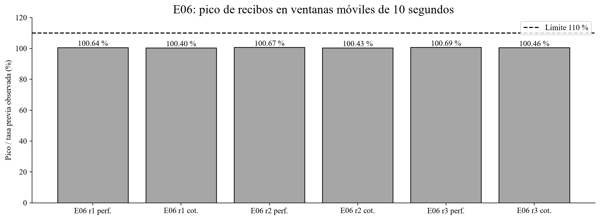

### E07 y E08. Vigencia de datos y consentimiento

E07, respaldo ausente. Con el proveedor caído se retiró la copia alternativa de datos. Se esperaba una respuesta controlada sin oferta definitiva, porque no había una fuente elegible para completarla.

E07, respaldo vencido. Se mantuvo una copia que había perdido vigencia. Se esperaba que el sistema la descartara como fuente. Consultar su estado para comprobar la vigencia no equivale a utilizarla para producir una respuesta.

E08, consentimiento revocado. Se retiró la autorización para usar el dato, también con el proveedor caído. Se esperaba denegación auditable y cero uso del dato. La disponibilidad no puede conseguirse ignorando esa autorización.

Resultados. En las tres condiciones se observaron cero usos de snapshot como fuente y cero ofertas definitivas. E08 registró además cero llamadas al proveedor y cero lecturas de snapshot. Se revisaron todas las fases disponibles, no solo los cinco minutos de medición. La tabla siguiente y los registros E07/E08 documentan el control; las figuras 3 y 4 complementan el desempeño y la completitud.

| Condición, tres repeticiones |Registros API, todas las fases |Snapshot como fuente |Oferta definitiva |Infracciones observadas |
| --- |--- |--- |--- |--- |
| E07 ausente |126005 |0 |0 |0 |
| E07 vencido |126004 |0 |0 |0 |
| E08 revocado |126004 |0 |0 |0 |

### Figura 3 Latencia: E07, E08, E09

Los percentiles proceden de la medición del cliente. E07 y E08 conservan los controles de autorización; E09 muestra el comportamiento sin circuito.

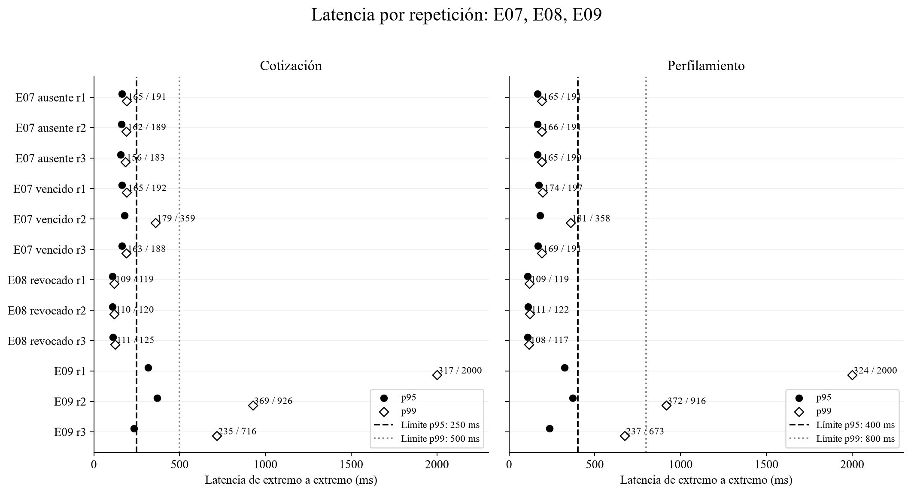

Dictamen: Pasan E07 ausente, E07 vencido y E08 en sus objetivos de seguridad, latencia y completitud. No se usaron copias no elegibles ni se emitieron ofertas definitivas; E08 tampoco consultó proveedor o respaldo. Se conservan estos controles antes de todo acceso al dato. Las respuestas preliminares y las denegaciones son el resultado esperado de estos casos, no ofertas exitosas. Los cinco recibos no confirmados de E07 ausente r3 se mantienen en la evaluación de trazabilidad.

### E10 y E11. Cierre de la ejecución

E10 estaba previsto para comparar plazos de 80, 120 y 160 ms; E11, para confirmar la opción seleccionada. No se ejecutaron y se cancela su ejecución adicional. El protocolo S5 reservaba la aceptación formal a E11 y no permitía suprimirla por restricciones de capacidad. Terminar la campaña con E01–E09 constituye, por tanto, una desviación explícita de ese protocolo: se cierra la investigación con evidencia parcial y la hipótesis conjunta no aceptada, sin declarar una excepción aprobada por el curso. Se preservan el protocolo original y sus criterios. Los 120 ms se conservan como parámetro de diseño medido, coherente con el presupuesto por dependencia, no como óptimo seleccionado entre alternativas.

La conclusión de esta entrega se fundamenta en los resultados de E01 a E09. Se mantienen los dictámenes por objetivo y los estados automáticos originales/derivados. No se obtuvo confirmación E11; no se evaluó la sensibilidad E10; y las modificaciones propuestas para el producto no tienen una validación experimental posterior. Estos límites acompañan las decisiones de arquitectura y las tareas de Proyecto Final 2.

## 3. Análisis de incidencias

### 3.1. Clasificación de incidencias

Una solicitud no emitida es trabajo que el generador no llegó a enviar: 165 casos durante medición y 40 durante calentamiento. Una respuesta no completa es una solicitud enviada cuyo resultado no cumple los requisitos técnicos: 802 durante medición. Un recibo no confirmado significa que se registró una llamada al proveedor, pero falta la evidencia que permita confirmar su recepción: 33 en el lote. Estos conteos describen etapas diferentes y no se suman como si fueran fallas independientes.

La figura 5 y el archivo de incidencias conservan la clasificación, la fase y las correlaciones disponibles. En E09 se concentra buena parte del resultado adverso:

| Evidencia medida |Hallazgo |Interpretación |
| --- |--- |--- |
| E09 r1 |394 respuestas sin completitud; 96 iteraciones no emitidas; 19 sin API correlacionada |375 tienen cierre de API, pero el cliente agotó su plazo. No basta con observar cierre en servidor. |
| E09 r2 |115 respuestas sin completitud; 69 iteraciones no emitidas; 11 sin API correlacionada |106 clasificadas como error técnico y nueve con otra clasificación; todas quedan fuera de completas. |
| E09 r3 |247 HTTP 503 correlacionados: consentimiento 181, snapshot 36, proveedor 30 |No hay iteraciones descartadas ni API medida ausente. Persiste un resultado adverso incluso cuando el generador emite toda la carga. |
| Conciliación del lote |33 recibos de proveedor no confirmados |Afectan 14 corridas junto con otras incidencias; no se fabrican recibos ni se declaran entregas exitosas. |

### Figura 5 Respuestas no completas por corrida

La clasificación y la completitud son campos distintos. Las nueve respuestas adicionales de E09 r2 mantienen su clasificación original y se excluyen del numerador de completitud.

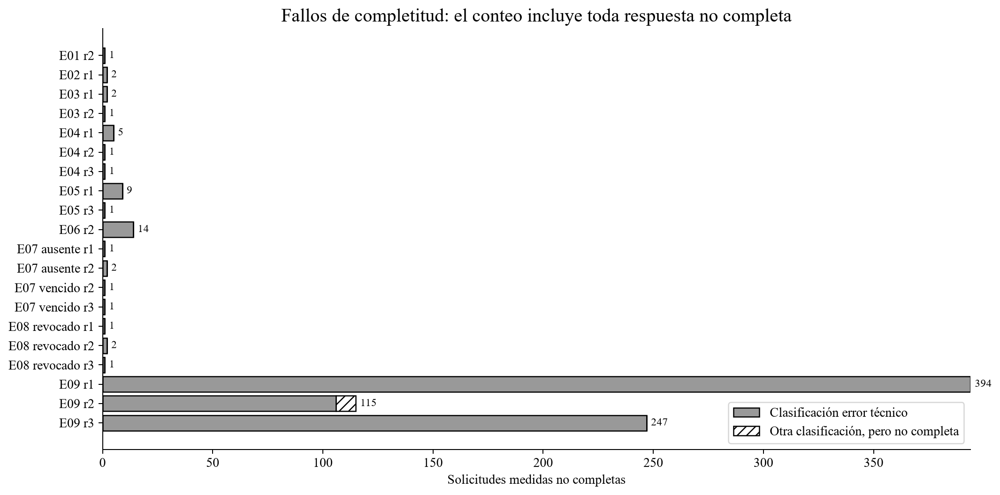

### 3.2. Evaluación de las causas

Las respuestas HTTP 503 indican que el servicio no pudo completar el procesamiento; son un resultado adverso, no una denegación de negocio esperada. Las trazas de consentimiento y snapshot ubican esperas durante consultas, pero no separan aún cuánto corresponde a la base de datos, a Hyperdrive, a la conexión o a la ejecución del servicio. Las capturas 12 a 14 muestran esa localización en E03; no son evidencia de todas las corridas ni prueban que todos los errores tengan el mismo origen.

Por ello no atribuimos el conjunto de fallas a Cloudflare. “Proveedor” tiene dos sentidos que deben distinguirse: el simulador de Open Finance, al que inyectamos errores deliberadamente, y los servicios de infraestructura que sostienen el banco. Solo las fallas inyectadas tienen una causa controlada por diseño. En las incidencias restantes hay una etapa localizada o una laguna de observación, no una causa exclusiva demostrada.

### Figura 10 Cierres registrados en Cloudflare

Captura directa del volumen de eventos handler_end de Acquisition en E03 repetición 1. Incluye calentamiento y ambas operaciones; no se utiliza como denominador de solicitudes medidas.

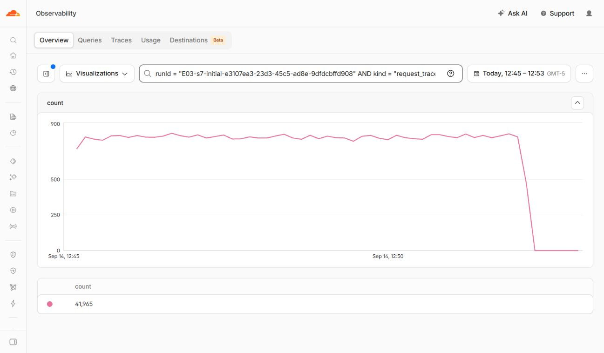

### Figura 11 Duración del handler en Cloudflare

Captura directa del p95 de durationMs para la misma consulta. Mide duración en el servicio y no latencia de extremo a extremo; no sustituye la figura 1.

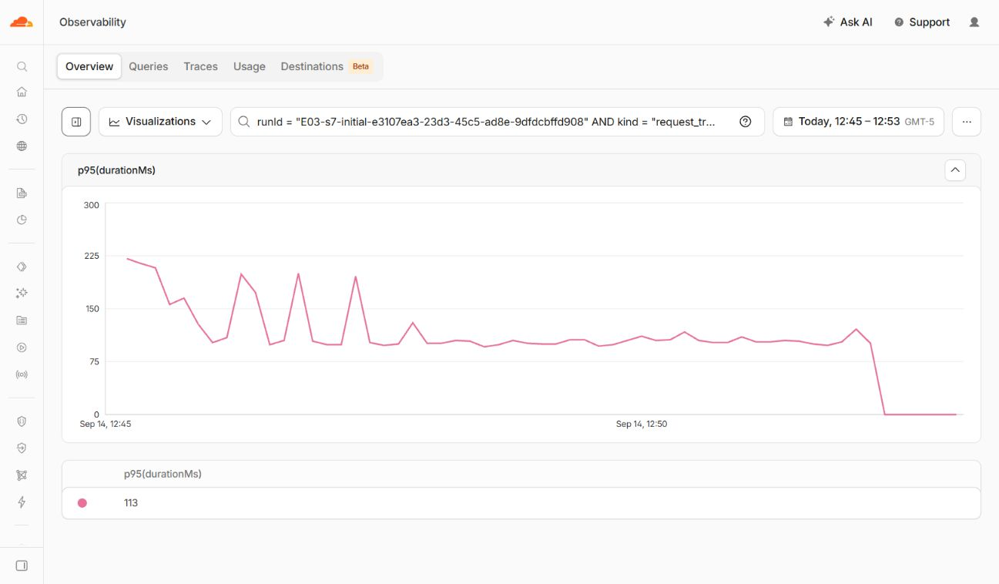

### Figura 12 Consulta del snapshot en E03

La traza de profile-11404 sitúa la espera en la consulta del snapshot y registra cancelación. Se contrasta con el HTTP 503 del cliente, sin atribuir por sí sola la causa de la demora.

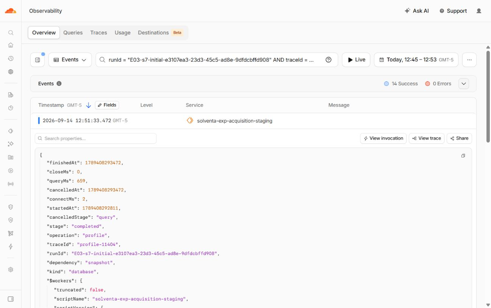

### Figura 13 Cierre de Identity en E03

El servicio interno registra un cierre con error durante la validación de consentimiento de quote-11713. Su estado se distingue de la respuesta posterior de Acquisition al cliente.

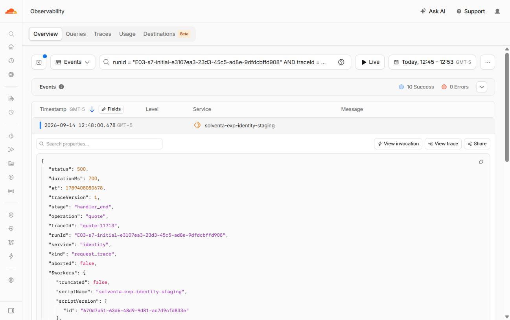

### Figura 14 Consulta de consentimiento en E03

La solicitud registra cancelación durante la consulta SQL después de conectar. Acota la etapa afectada sin responsabilizar de forma exclusiva al proveedor de infraestructura.

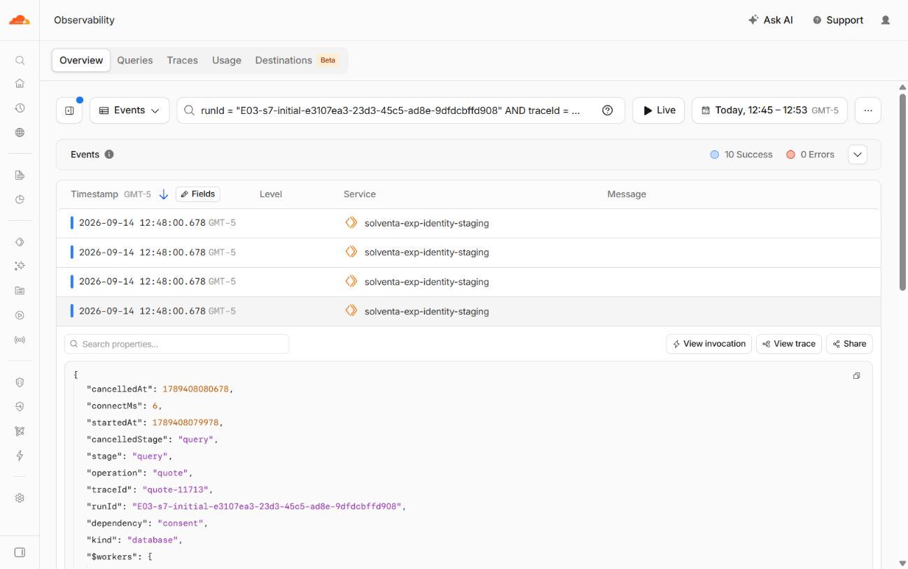

La investigación anterior es compatible con que algunas cancelaciones ocurran antes de que el simulador registre recepción. Esa explicación sigue siendo una hipótesis. Los fallos inyectados al simulador están definidos por el caso; los retrasos e incidencias de infraestructura no deben confundirse con esa condición controlada. Confirmamos un defecto en nuestro analizador. Para las demás incidencias identificamos la etapa afectada, pero no pudimos determinar una causa exclusiva en la infraestructura.

### 3.3. Corrección del cálculo del intervalo de sondeos

El analizador original contaba los intervalos desde que comenzaba la solicitud API (startedAt), pero la consulta de prueba al proveedor ocurría después de validar el consentimiento. Si esa validación tarda distinto en dos solicitudes, comparar sus horas de inicio puede hacer parecer que los sondeos se juntaron demasiado, aunque el circuito haya respetado el intervalo real.

Reprodujimos las 52 alertas del análisis original y recalculamos con la hora del evento de sondeo: breakerEvents, evento probe, campo at, por proceso y operación. No cambiamos la regla: tres sondeos en menos de 30.000 milisegundos constituyen una infracción; exactamente 30.000 no la constituye según el algoritmo existente. Esta corrección responde a un error de medición nuestro y no a una mejora del proveedor.

| Corrida |Alertas originales |Alertas con instante de sondeo |Estado original → derivado |
| --- |--- |--- |--- |
| E04 r2 |7 |0 |Inconcluso → Inconcluso |
| E04 r1 |10 |0 |Ajustar → Criterios básicos cumplidos |
| E06 r1 |15 |0 |Inconcluso → Inconcluso |
| E04 r3 |8 |0 |Inconcluso → Inconcluso |
| E06 r3 |12 |0 |Ajustar → Criterios básicos cumplidos |

El nuevo conteo es cero en las 30 corridas, tanto en los grupos del análisis original como al revisar todas las fases. El control adicional usando instantes de despacho también produce cero. Se comprobó correspondencia de cantidades entre solicitudes marcadas como sondeo y eventos del circuito, y se conservaron las 52 ventanas originales con ambos intervalos en sondeos.csv. No se cambió el deadline, el circuito, la carga ni el código fuente congelado del banco.

Cada archivo analysis-derived-probes.json conserva la referencia y la huella SHA-256 de su analysis.json original; esa huella permite comprobar que el archivo fuente no se sustituyó. E04 repetición 1 y E06 repetición 3 pasan de “Ajustar” a “Criterios básicos cumplidos”. E04 repeticiones 2 y 3 y E06 repetición 1 siguen “Inconcluso” por evidencia ausente. La figura 6 permite contrastar los dos conteos.

La corrección ya se integró en el analizador y se verificó con 52 pruebas automatizadas, incluida la frontera exacta de 30 segundos. El recálculo de las 30 corridas reprodujo la corrección, preservó los resultados por operación y comprobó las huellas de los análisis originales. Los eventos concurrentes se concilian por instancia y operación, porque una respuesta puede guardar eventos del mismo circuito generados por otra solicitud. No fue necesario ejecutar nueva carga.

### Figura 6 Revisión de alertas de sondeos

Se cambia únicamente el instante de referencia en el análisis derivado. Los archivos originales y el resto de los criterios permanecen intactos.

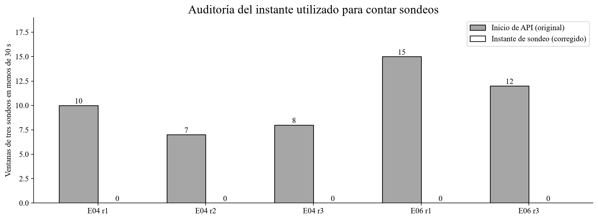

## 4. Ajustes propuestos

Se decide conservar el adaptador, el cortacircuitos local, el plazo de 120 ms y los controles de consentimiento y vigencia. Los cambios propuestos se concentran en la recuperación de lecturas SQL, la disponibilidad de señales autorizadas y la trazabilidad. La tabla distingue qué está corregido en el banco de lo que se propone incorporar al producto.

La tabla indica qué componente debe cambiar y qué efecto se espera de cada medida en Proyecto Final 2.

| Problema observado |Acción propuesta |Cambio y consecuencia |
| --- |--- |--- |
| Fallback inesperado en E01 y p99 de E05 r2 |Mantener 120 ms y añadir recuperación acotada de lecturas SQL en sus propietarios. |Evitar que una demora transitoria termine en error. El reintento consume tiempo y no asegura cumplir el p99. |
| Alta degradación en E04 y estado local variable |Actualizar señales autorizadas mediante outbox y Queue de Acquisition & Risk. |Disponer de respaldo reciente sin esperar toda la integración en línea; añade trabajo asíncrono y control de vigencia. |
| Esperas en consentimiento y snapshot |Reintentar una lectura transitoria; bloquear si no se verifica consentimiento; informar respaldo no disponible. |Conservar autorización y distinguir error de dependencia de resultado preliminar. No emitir oferta sin datos elegibles. |
| Recibos y API ausentes; discrepancia cliente/servidor |Persistir resultado y auditoría con outbox; conservar correlación, despacho y confirmación por separado. |Reconstruir decisiones sin depender del muestreo del dashboard. Añade almacenamiento e idempotencia. |
| Defecto del cálculo de sondeos |Cálculo integrado con el instante real de admisión del sondeo, agrupado por instancia y operación. |Corregido: 52 pruebas pasan; 30 corridas recalculadas; 52 falsas alarmas eliminadas sin repetir carga. |

### 4.1. Trazabilidad y análisis de resultados

El cálculo de sondeos está corregido y verificado. Para el producto se mantendrá un identificador de extremo a extremo y un registro durable del resultado en el servicio propietario. Acquisition & Risk guardará resultado, decisión de suscripción, auditoría y outbox en su transacción local; Identity conservará la decisión de autorización en su propio esquema. La publicación será asíncrona y cada consumidor deduplicará eventId junto con su efecto local antes de confirmar el mensaje. Despacho, recibo y cierre permanecerán separados: un despacho sin confirmación no se declarará recibido. Si el commit falla o queda incierto, no se afirmará que la decisión o su auditoría están persistidas; se devolverá error técnico y se reconciliará por la clave idempotente. El cambio reduce la dependencia del muestreo del panel, pero no elimina los fallos de persistencia ni reconstruye recibos históricos ausentes.

### 4.2. Presupuesto de respuesta y calidad del respaldo

Se mantiene el plazo de 120 ms del adaptador; E01 y E02 cumplen los percentiles con esa configuración. Para E04 y las caídas prolongadas se propone actualizar las señales desde Acquisition & Risk mediante una cola de mensajes (Queue) y su registro de eventos pendientes (outbox). Identity conserva la decisión de consentimiento; el trabajo asíncrono vuelve a validarla y registra fuente, vigencia y versión de autorización. La respuesta inmediata muestra respaldo o estado preliminar y no presenta una oferta definitiva si falta información elegible. Esto permite responder con datos obtenidos previamente, cuya vigencia y actualización deberá gestionar Acquisition & Risk.

### 4.3. Recuperación de lecturas SQL

Se propone incorporar la recuperación acotada ya desarrollada como opción diagnóstica: solo una lectura SELECT idempotente ante error transitorio permitido; primer intento de hasta 200 ms; cierre de la conexión y como máximo un reintento con espera de 10–25 ms, si queda presupuesto dentro del límite total de 700 ms. El presupuesto local por instancia y dependencia admite una ráfaga de dos reintentos y repone cinco por segundo. No se reintentan escrituras ni errores de autorización. Esta política no añade reintentos síncronos al proveedor Open Finance. Si el consentimiento no puede verificarse, se bloquea el uso del dato y se conserva la clasificación técnica. Si falla la lectura del respaldo después de autorizar, puede mostrarse una salida preliminar sin datos ni oferta, identificando el error: no se reclasifica el HTTP 503 histórico como respuesta completa. Las pruebas diagnósticas registraron respuestas de hasta 836 ms. El cierre de conexiones y la respuesta deben presupuestarse; no se ha demostrado mejora de p99 ni cumplimiento E2E con esta propuesta.

### 4.4. Recuperación y alcance del circuito

Se conserva el circuito por instancia y operación: ventana de 20 muestras en 30 s, mínimo diez, apertura al 50 % de fallas, espera de 30 s, máximo dos sondeos por ventana y cierre tras cinco éxitos. La reducción de llamadas de E05 y los 219 cierres de E06 respaldan esta elección, con los incumplimientos y horizontes incompletos ya descritos. La observabilidad distinguirá circuito abierto, en recuperación y cerrado, e informará por separado la última actividad del proceso; «sin actividad» es una condición de observación, no un nuevo estado del algoritmo. No se interpreta ausencia de tráfico como circuito atascado ni se añade coordinación global al recorrido de respuesta.

### 4.5. Incorporación de las medidas al producto

Cada componente conservará su responsabilidad: Identity verifica consentimiento; Acquisition & Risk obtiene señales, responde y mantiene su respaldo y auditoría; Queue entrega mensajes al menos una vez y el consumidor realiza la deduplicación; CockroachDB guarda los datos de cada propietario. Las propuestas se registran como decisiones de diseño para implementación posterior. La referencia de consentimiento en un mensaje no concede autorización: el consumidor comprueba propósito, alcance y versión antes de consultar y antes de aplicar señales, y cada uso posterior vuelve a validar el permiso. No se incorpora coordinación global ni una transacción distribuida entre propietarios. La salida preliminar conserva su condición en la interfaz; una oferta definitiva requiere datos elegibles y cálculo completo.

El cálculo del analizador está corregido; las políticas SQL existen como opciones diagnósticas; la actualización asíncrona de señales y la integración de auditoría del producto son propuestas de implementación.  Los diagramas existentes de Lucidchart no han sido modificados por esta revisión.

## 5. Conclusiones

| Objetivo |Conclusión sustentada |
| --- |--- |
| Latencia y completitud |Pasa en 52 de 60 resultados. No pasa en E05 r2 cotización, E06 r2 perfilamiento y las seis mediciones del control E09. |
| Línea base y calidad funcional |E01: no pasa cero respaldo, con 25/90.000 degradadas (0,0278 %). E04: pasa sus metas; hasta 90,38 % de degradación motiva mejorar frescura. |
| Reducción y apertura |Pasa la reducción: 92,24–97,31 % frente a 80 %. No pasa la apertura de todos los grupos en 30 s desde la caída. Se conserva el circuito local. |
| Recuperación |Pasan cinco éxitos previos a los 219 cierres y el pico <110 %. E06 no pasa completitud en perfilamiento r2; se propone recuperación SQL. |
| Privacidad y trazabilidad |Pasa el uso autorizado de datos en E07/E08. No pasa trazabilidad completa: 33 recibos sin confirmar y otras lagunas. Se propone auditoría durable. |
| Hipótesis conjunta |No pasa el cumplimiento simultáneo. Decisión: conservar los mecanismos respaldados y aplicar ajustes concretos de resiliencia y trazabilidad. |

### 5.1. Evaluación de la hipótesis

La configuración evaluada no pasa la hipótesis de cumplimiento simultáneo: E01 registra respaldo inesperado, E05 r2 supera el p99 de cotización y E06 r2 incumple la completitud de perfilamiento. Conservaremos la base del diseño e incorporaremos medidas para recuperar consultas y registrar las decisiones. Los resultados favorables sostienen esa decisión: E02, E03 y E04 cumplen sus objetivos de desempeño, E07 y E08 protegen los datos y E05 reduce entre 92,24 % y 97,31 % las llamadas frente al control sin circuito.

Las 25 degradaciones de E01 entre 90.000 solicitudes representan 0,0278 %; justifican mejorar la gestión de las consultas. En E04, una degradación de hasta 90,38 % mantiene la respuesta pero reduce el acceso a señales actuales, por lo que se propone actualizar el respaldo de forma asíncrona. En E09, las 756 solicitudes incompletas y los incumplimientos de desempeño al desactivar el circuito justifican conservar esa protección. Las respuestas preliminares sin oferta se contabilizan como continuidad técnica y se distinguen de una cotización completada con señales actuales.

Las 30 corridas muestran que el cotizador y el perfilador contienen fallas externas mediante cancelación, circuito y respaldo autorizado. También permitieron corregir el cálculo de sondeos del analizador. Para atender los incumplimientos proponemos recuperar lecturas SQL transitorias, actualizar el respaldo autorizado, identificar las respuestas preliminares y guardar la auditoría del negocio. La experimentación de esta entrega queda cerrada.

### 5.2. Decisiones para Proyecto Final 2

Se mantendrán el adaptador, el circuito local, los 120 ms y las verificaciones de consentimiento y vigencia. Se proponen tareas de recuperación SQL, actualización asíncrona del respaldo, estados de respuesta claros y auditoría con outbox e idempotencia. Cada tarea tendrá un componente responsable. Las respuestas distinguirán entre cotización definitiva, respuesta preliminar, denegación y error técnico.

En Proyecto Final 2 esperamos mantener una respuesta rápida y comprensible cuando falle la fuente externa, usar solo datos autorizados y ofrecer un respaldo más actualizado. Las mejoras propuestas se incorporarán como tareas de implementación. Este informe cierra la experimentación con los resultados obtenidos.

### 5.3. Condiciones del laboratorio y tratamiento de evidencias

El laboratorio utilizó un proveedor simulado, CockroachDB de una región y k6 desde Bogotá. Los tiempos del cliente se midieron en su propio reloj; las estimaciones de desfase entre sistemas estuvieron entre −94,5 y 24,5 ms. Los atributos evaluados son la latencia de cotización y perfilamiento, la continuidad ante fallas del proveedor y el uso autorizado de datos. Disponibilidad mensual, recuperación regional y los demás flujos del producto son objetivos distintos del diseño.

Las capturas 10 y 11 muestran E03 r1, con calentamiento y ambas operaciones: 41.965 cierres en el panel frente a 42.002 registros API exportados. Se usan los archivos del banco para los conteos y el cliente para la latencia. Posteriormente se observó un aviso de muestreo del 1 % en Observability; al desconocerse su inicio, la ausencia de un evento en ese panel no se toma como prueba de que una solicitud no ocurrió. El registro durable del banco es independiente de ese muestreo y sus recibos faltantes permanecen registrados.

El informe y el registro de evidencias están en Drive. Los archivos originales conservan sus estados y huellas, y las figuras muestran los resultados obtenidos. Las decisiones de este cierre se integran al plan de implementación; los permisos de entrega, el video y la actualización gráfica de los modelos se gestionan en los documentos correspondientes.

## Referencias y reproducción de los resultados

Los criterios proceden del [protocolo experimental preregistrado de Semana 5](https://docs.google.com/document/d/1ojgu0vQBPDDUtLLbq0zzLS3dnSZHvwO2PkfPbBGdzNM/edit), cuya copia se conserva en [protocolo-s5.md](protocolo-s5.md). La [entrega oficial de Semana 7](https://www.coursera.org/learn/miso-proyecto-1/assignment-submission/J2Z0o/entrega-semana-7) rige los criterios de la entrega académica.

La [carpeta de evidencias experimentales](https://drive.google.com/drive/folders/11Mw4NfLJkKveZMJeMDr9IgAThBlqIuGO) contiene copias de resultados, configuración y manifiestos; analisis-30.json incluye métricas, incidencias, eventos, series, comparaciones y 120 huellas de archivos fuente. verificacion-ventanas.json conserva configuración emparejada, aperturas y grupos censurados. Se entregan seis CSV para revisión, nueve gráficas en PNG/PDF y cinco capturas originales, enlazados en el [registro de evidencias](registro-evidencias.md).

La [guía pública de reproducción](https://github.com/AlejandroForeroG/solventa-laboratorio/blob/main/docs/reproduccion.md) explica cómo obtener y verificar los 30 ZIP de la versión laboratorio-s7 y reconstruir los análisis. npm run demo recalcula E05 r2 desde registros reales y reproduce p95 de cotización de 238 ms y p99 de 556 ms, que sigue sin pasar el límite de 500 ms. Los scripts analizar-30.py, verificar-ventanas-30.py y graficar-30.py están en [tools/analisis](../tools/analisis); se reprodujeron el análisis de las 30 corridas, la verificación de ventanas y las 14 figuras. Las 52 pruebas automatizadas y la revisión de tipos pasaron. Estas comprobaciones verifican la reproducción y el código del laboratorio; no validan nuevas cargas ni los ajustes propuestos para el producto.

## Glosario

Escenario: condición preparada para responder una pregunta concreta, por ejemplo un proveedor lento o un consentimiento revocado. Corrida o repetición: una ejecución completa de esa condición.

Latencia de extremo a extremo: tiempo total que espera el cliente. p95 y p99: tiempos que no superan el 95 % y el 99 % de las solicitudes, respectivamente.

Completitud técnica: proporción de solicitudes emitidas que tienen una respuesta válida, clasificada y correlacionada; no equivale a obtener una oferta.

Wilson: método estadístico para expresar la incertidumbre de una proporción. Aquí se compara su límite inferior, con confianza del 95 %, contra 99,9 %.

Open Finance: fuente externa de señales financieras consultadas con autorización. En este banco se representa mediante un simulador.

Adaptador: componente que traduce la respuesta del proveedor al formato que usa Solventa. ACL: capa que evita trasladar directamente al dominio las particularidades del sistema externo.

Tiempo límite o deadline: máximo que se permite esperar una operación. Timeout: resultado de agotar ese tiempo.

Cortacircuitos o circuit breaker: mecanismo que suspende llamadas tras acumular fallas y prueba después si la dependencia se recuperó. Sondeo o probe: una de esas llamadas de comprobación.

Respaldo o fallback: alternativa usada cuando la fuente principal no responde adecuadamente. Snapshot: copia de datos que solo puede usarse si conserva autorización y vigencia.

Proceso aislado o isolate: unidad de ejecución que mantiene su propio estado del circuito. Sus decisiones no se comparten automáticamente con todos los procesos.

Trazabilidad o correlación: capacidad de seguir una solicitud entre componentes usando un mismo identificador. Conciliación: contraste entre registros para comprobar qué ocurrió en cada etapa.

API o endpoint: servicio o punto de entrada que recibe una solicitud. HTTP 503: respuesta de error que indica que el servicio no pudo completarla.

Cloudflare Workers: plataforma donde se ejecutan los servicios del banco. Hyperdrive: servicio de conexión a la base de datos. CockroachDB: base que conserva los datos sintéticos de prueba. SQL: lenguaje usado para consultarlos.

k6: herramienta que genera la carga de prueba. Calentamiento: periodo previo que prepara el sistema y se excluye del dictamen de medición.

Huella SHA-256: valor que permite detectar cambios en un archivo. CSV: tabla de datos exportada. JSON: archivo estructurado con configuración, resultados o eventos.

Registro de decisión arquitectónica (ADR): documento que justifica una elección de diseño, sus alternativas y consecuencias. Confirmación: repetición prevista por el protocolo para verificar la configuración seleccionada.

### Identificación técnica del banco

Acquisition: 8b7f3d37-2afa-4789-9aed-6ee05ef34100. Identity: 670d7a51-63d6-48d9-9d81-ac7d9cfd833e. Simulator: 4c1d53ce-1c0d-4214-9355-3626154540be. Cada run.json y source-manifest.json conserva la referencia ejecutada. Las correcciones anteriores de conciliación, cancelación y persistencia V2 son antecedentes del banco; no prueban la desaparición de todas las fallas intermitentes.
